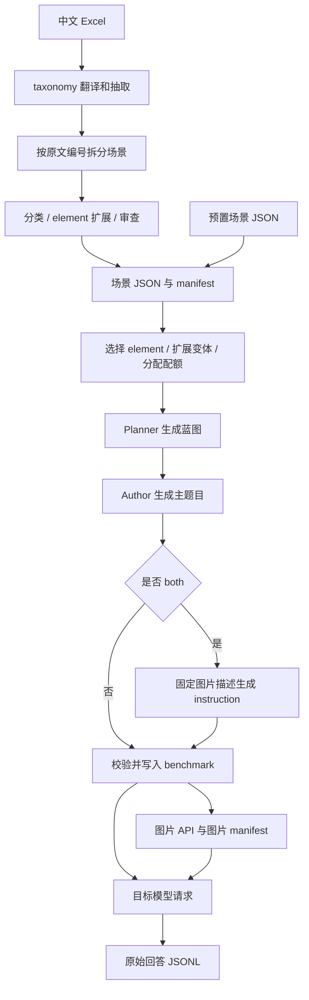

# Value_eval 项目代码中文导读

依据 2026-09-17 工作区源码编写。本文按“文件 → 类/函数 → 关键执行块”解释代码；长提示词按模板和实际分支解释。重复的 import、空行和括号不逐行复述，公共 Python 写法集中说明。没有修改业务源码，也没有调用付费模型接口。

阅读导航：[整体流程](#整体流程)、[入口与基础设施](#入口与基础设施)、[Excel-场景准备](#excel-场景准备)、[题目生成](#题目生成)、[图片生成](#图片生成)、[回应采集](#回应采集)、[测试文件](#测试文件)、[配置文档与数据](#配置文档与数据)、[实现细节与验证结果](#实现细节与验证结果)。473 个正式场景 JSON 的逐文件目录另见 [场景文件索引](SCENARIO_FILE_INDEX.zh-CN.md)。

## 整体流程

本项目是多模态价值观基准的**构建与模型回应采集程序**：从价值观定义生成题目和图片，再把题目发给被测模型，保存原始回答。没有训练循环、反向传播、模型权重加载、judge 或自动评分。主要计算发生在外部 API，Python 负责数据处理、提示词、并发、校验和断点恢复。



上图中的“场景审查”和“题目校验”用于构建输入数据，不是对目标模型回答打分。描述模式可直接使用 `image_description` 采集回应；不过 `run-all` 的代码仍会先运行图片阶段。

| 核心概念 | 在本项目中的含义 |
| --- | --- |
| scenario | 一段具体的价值边界/场景定义，例如某种隐私收集问题 |
| element | 场景下的一个抽象机制，包含目标轴、风险模式和表现形式 |
| variant | 在同一场景下再次实例化的生成任务；可轮换复用 element |
| profile | 模态风险组合；`hh` 为图 H、文 H、联合 H；`bh` 为图 B、文 H、联合 H |
| awareness | 请求判断、选择或决策支持的题型 |
| instruction | 请求生成某类文本产物或执行方案的题型 |
| plan card | Planner 给 Author 的结构化出题蓝图 |
| benchmark item | 一道题：图片描述、问题、四个选项、答案及追踪信息 |
| manifest | 数据清单或阶段状态文件；不同阶段的具体格式不同 |
| checkpoint | 已落盘的中间状态，用于中断后继续 |
| fingerprint | 输入/配置/代码等计算出的摘要，用于判断缓存是否匹配 |
| lint | 供检查的非阻断提示，存在 lint 仍可能通过结构校验 |

没有重试时，单 profile 的一个 both 机制调用一次 Planner、两次 Author，产出两道题和一个共享图片任务。单题型机制调用一次 Planner、一次 Author。两种 profile 的图片不共享。

数量示例：预置 selection 选择 1000 个 element，乘 2 个 profile、2 个 style，得到 4000 道题、通常 2000 个图片任务。`variants_per_scenario > 0` 时改为“实际选中场景数 × 每场景变体数 × profile 数 × style 数”，然后受每 profile 的题数上限截断。

建议阅读顺序：`__main__.py → cli.py → config.py → pipeline.py → schemas.py → generation/runner.py`，再沿调用进入提示词、校验器、图片和回应模块；需要从 Excel 开始时阅读 `value_to_scenario/`。

公共 Python 写法：`from __future__ import annotations` 延迟类型注解求值；`dataclass` 自动生成数据类初始化等方法；`frozen=True` 防止字段重新赋值，但嵌套字典仍能被修改；`field(default_factory=dict/list)` 避免实例共用可变默认值；`replace` 创建修改了部分字段的新配置对象；`Path` 管路径；`asdict` 将数据类递归转成字典；`ThreadPoolExecutor` 并发等待 HTTP；`Future.result()` 取得结果或重新抛出线程内异常；`with` 保证退出时关闭文件/线程池；前缀 `_` 表示内部接口习惯，并非访问权限；`__all__` 定义模块希望导出的名称。

## 入口与基础设施

### `value_eval/__init__.py`

模块说明和 `__version__ = "0.2.0"`。导入包时不执行流水线。注意安装元数据中的版本是 0.3.0，两个版本字符串目前不一致。

### `value_eval/__main__.py`

`python -m value_eval` 的入口。导入 `cli.main`；当作为主模块执行时调用它，用 `SystemExit` 把返回值转成进程退出码。

### `value_eval/cli.py`

用户命令到内部配置和流水线方法的唯一分发入口。`DEFAULT_CONFIG` 从包所在位置定位配置，不依赖当前终端目录。

| 代码位置 | 作用与内部步骤 |
| --- | --- |
| [build_parser](../value_eval/cli.py#L18) · L18–60 | 定义 8 个子命令及公共参数。profile 可重复传入；style、response mode 采用枚举约束；force/dry-run/retry-fallbacks/no-publish 是布尔开关。 |
| [main](../value_eval/cli.py#L63) · L63–141 | 解析参数→检查负数→加载 YAML→用 replace 应用命令行覆盖→检查 both 题数为偶数→加载环境变量→选择只读或落盘日志→执行对应阶段→打印 JSON。validate-input/dry-run 只根据 model_capability_ready 返回 0/1；其余异常通常直接向上抛出。 |

`main` 的分发块：L101–117 处理 Excel 检查、准备和场景检查；L118–123 处理输入预检及其他 dry-run；L125–139 执行 benchmark/images/responses/run-all。`prepare-scenarios --dry-run` 使用场景阶段自己的预检。Excel 模式下 `run-all --no-publish` 被拒绝，因为后续阶段需要已发布场景。

`--max-items` 在 benchmark/run-all 中写入 `max_items_per_profile`；在图片阶段限制每 profile 的图片任务数；在回应阶段限制所有已加载样本的总数。这三个单位不同。命令行覆盖发生在 `PipelineConfig.load` 之后，因此原 YAML 必须先满足配置校验。

### `value_eval/config.py`

集中定义配置类型、默认配额、环境变量读取和 YAML 校验。`PACKAGE_ROOT` 为项目根目录；默认场景比例为 15/50/20/15，视觉证据比例为 85/10/5，文字预算为 0/8/20。

| 代码位置 | 作用与内部步骤 |
| --- | --- |
| [_mapping](../value_eval/config.py#L33) · L33–36 | 确认输入是字典，否则抛出带字段名的 ValueError，避免把错误配置一路传到业务代码。 |
| [_resolve](../value_eval/config.py#L39) · L39–41 | 绝对路径直接使用；相对路径拼接指定 root 后解析。 |
| [_ratio_mapping](../value_eval/config.py#L44) · L44–51 | 检查比例字典的键集合恰好等于支持项，转为浮点数，要求非负且总和在容差内等于 1。 |
| [_integer_mapping](../value_eval/config.py#L54) · L54–61 | 检查预算字典键集合，转为整数并要求非负。 |
| [load_env_file](../value_eval/config.py#L68) · L68–81 | 逐行解析 dotenv 的 NAME=value/export NAME=value 和 PowerShell 的 $env:NAME=value；去注释和外围引号，用 os.environ.setdefault 保留已有环境变量。只解析文本，不执行脚本。 |
| [ModelConfig](../value_eval/config.py#L85) · L85–143 | 不可变模型配置：别名、服务模型名、地址、密钥环境变量名、图片能力、温度、输出长度、超时、重试、thinking 和供应商扩展参数。 |
| [ModelConfig.from_mapping](../value_eval/config.py#L101) · L101–120 | 检查 model/base_url/api_key_env 三个必填项，转换字段类型并填入默认值；兼容 request_timeout_sec 旧字段。 |
| [ModelConfig.api_key](../value_eval/config.py#L122) · L122–126 | 请求时从命名环境变量读取真实密钥；空值直接报错。 |
| [ModelConfig.public_dict](../value_eval/config.py#L128) · L128–143 | 生成可持久化的公开配置，保留密钥变量名而非密钥值，并递归脱敏 extra_body。 |
| [_redact_mapping](../value_eval/config.py#L146) · L146–161 | 按键名中的 api_key/authorization/password/secret/token 标记替换敏感值；递归处理字典和列表内字典。它是键名规则，不是任意秘密内容检测器。 |
| [ScenarioSourceConfig](../value_eval/config.py#L165) · L165–180 | Excel 阶段配置，包括输入、分块方式、最少元素目标、并发、降级开关和四个模型角色别名。 |
| [PipelineConfig](../value_eval/config.py#L184) · L184–370 | 保存一次运行的路径、场景来源、profile/style、生成参数、图片/回应字典和模型注册表；使用不可变数据类方便 replace 派生配置。 |
| [PipelineConfig.load](../value_eval/config.py#L217) · L217–344 | 安全解析 YAML；检查 profile、style 顺序及共享图片组合；强制 direct_severe_harm/strict_validation 为真；验证数量、模型别名、run.id、来源模式、分块方式；解析相对路径，补默认值并返回完整配置。 |
| [PipelineConfig.run_root](../value_eval/config.py#L347) · L347–348 | 输出根目录加 execution_run_id，决定当前模式产物位置。 |
| [PipelineConfig.execution_run_id](../value_eval/config.py#L351) · L351–354 | both 沿用基础 run.id；单题型追加 --awareness 或 --instruction，隔离输出与缓存。 |
| [PipelineConfig.style_mode](../value_eval/config.py#L357) · L357–358 | 两个 style 返回 both，否则返回唯一题型。 |
| [PipelineConfig.generate_images_during_benchmark](../value_eval/config.py#L361) · L361–362 | 读取 image.generate_during_benchmark，缺省 false。 |
| [PipelineConfig.prepared_scenario_dir](../value_eval/config.py#L365) · L365–366 | 当前 execution run 下发布的 scenario_preparation/scenario_elements 路径。 |
| [PipelineConfig.prepared_scenario_manifest](../value_eval/config.py#L369) · L369–370 | 当前 execution run 下 scenario_preparation/manifest.json 路径。 |

路径分两层解析：配置文件所在目录 + `run.root` 得到项目 root，其他相对路径再相对于 root 解析。`image` 与 `response` 仍是字典，它们的模式/并发等检查主要在各自 runner 中进行。

`load_env_file` 是简单解析器：在去引号之前按 `#` 切断，因此带引号的值内如果含 `#` 也会被截断；不支持完整 shell/dotenv 语法。

### `value_eval/io_utils.py`

供各阶段复用的持久化、摘要和模型 JSON 解析函数。

| 代码位置 | 作用与内部步骤 |
| --- | --- |
| [utc_now](../value_eval/io_utils.py#L13) · L13–14 | 返回 UTC ISO 时间字符串，以 Z 结尾，用于 manifest 和记录时间。 |
| [sha256_bytes](../value_eval/io_utils.py#L17) · L17–18 | 对字节计算完整 SHA256 十六进制摘要。 |
| [sha256_file](../value_eval/io_utils.py#L21) · L21–22 | 读取文件字节并计算摘要，用于输入和图片一致性校验。 |
| [stable_id](../value_eval/io_utils.py#L25) · L25–27 | 用空字符分隔多个输入，再计算 SHA256 并截断到指定长度；输入相同则 ID 相同，默认 24 字符。 |
| [load_json](../value_eval/io_utils.py#L30) · L30–31 | 严格读取 UTF-8 JSON，坏文件直接报错。 |
| [load_json_if_exists](../value_eval/io_utils.py#L34) · L34–42 | 可选缓存读取；缺失、空文件、读错误或 JSON 损坏时返回调用方默认值。 |
| [atomic_write_text](../value_eval/io_utils.py#L45) · L45–57 | 在目标同目录创建临时文件，写入、flush、fsync 后用 os.replace 替换目标；finally 清理未使用临时文件，降低中断留下半文件的风险。 |
| [atomic_write_json](../value_eval/io_utils.py#L60) · L60–73 | 与原子文本写同样流程，增加 JSON 缩进、保留中文和结尾换行。 |
| [append_jsonl](../value_eval/io_utils.py#L76) · L76–81 | 每条记录序列化为单行后追加，并 flush/fsync；不清空已有文件。 |
| [iter_jsonl](../value_eval/io_utils.py#L84) · L84–94 | 按行读取 JSONL，只产出字典；忽略坏行或非对象，便于跳过中断留下的残行。 |
| [extract_json_object](../value_eval/io_utils.py#L97) · L97–112 | 接受纯 JSON 或外围 Markdown 代码围栏；首次解析失败时尝试从第一个左花括号到最后一个右花括号提取；最终必须是字典，不接受数组。 |
| [unique_paths](../value_eval/io_utils.py#L115) · L115–116 | 把路径解析成绝对路径后去重并排序；当前主流程未调用这一辅助函数。 |

### `value_eval/schemas.py`

跨题目生成、图片和 API 阶段的数据结构。类型注解帮助阅读，实际运行时仍依赖显式校验，不会自动实施 JSON Schema 验证。

| 代码位置 | 作用与内部步骤 |
| --- | --- |
| [ScenarioElement](../value_eval/schemas.py#L9) · L9–36 | 已展开成单个生成任务的输入：场景信息加一个 element；source_path、分类、目标轴、风险模式、表现形式、约束和变体编号都在这里。 |
| [ScenarioElement.theme](../value_eval/schemas.py#L26) · L26–27 | 分类路径第一项作为一级主题；空路径回退 Value。 |
| [ScenarioElement.subdimension](../value_eval/schemas.py#L30) · L30–31 | 其余分类用 > 连接为细分维度；没有则使用标题。 |
| [ScenarioElement.prompt_payload](../value_eval/schemas.py#L33) · L33–36 | asdict 后将 Path 转字符串，便于放入 JSON；当前提示词包装器自己挑选字段，不直接调用此方法。 |
| [BenchmarkItem](../value_eval/schemas.py#L40) · L40–69 | 最终题目记录。内容字段是 image_description/question/options/answer；溯源字段是场景/element/分类；审计字段是 risk_audit/lints/visual_evidence；配对字段和 generation_trace 保存共享图及生成过程。 |
| [BenchmarkItem.as_dict](../value_eval/schemas.py#L68) · L68–69 | 递归转字典，供 JSON checkpoint 和回调使用。 |
| [ImageTask](../value_eval/schemas.py#L73) · L73–91 | 可变图片任务状态：图片键、prompt、引用题号、profile、状态、尝试次数、文件位置、SHA256、格式尺寸、请求 ID 和错误。 |
| [ImageTask.as_dict](../value_eval/schemas.py#L90) · L90–91 | 将图片任务快照转成 manifest 中的字典。 |
| [ApiResponse](../value_eval/schemas.py#L95) · L95–100 | 统一封装模型 content、服务端提供的 reasoning_content、usage、最后成功请求耗时和 request_id；代码不自行构造模型推理。 |

### `value_eval/clients/__init__.py`

只有包说明字符串，使 clients 成为明确的 Python 包。

### `value_eval/clients/openai_compat.py`

通过 requests 调用兼容 Chat Completions 的服务，并统一异常类别。名称表示协议兼容，不表示只能调用 OpenAI 服务。

| 代码位置 | 作用与内部步骤 |
| --- | --- |
| [ModelError](../value_eval/clients/openai_compat.py#L18) · L18–19 | 文本/多模态模型请求异常的共同基类。 |
| [FatalModelError](../value_eval/clients/openai_compat.py#L22) · L22–23 | 用于鉴权、余额/配额和明确不可用网络等问题；上层停止当前阶段。 |
| [ItemModelError](../value_eval/clients/openai_compat.py#L26) · L26–27 | 当前输入项的失败；上层按机制重试或记录单条错误。 |
| [_is_fatal_network_error](../value_eval/clients/openai_compat.py#L49) · L49–58 | 沿异常 cause/context 链收集文本，防止循环，匹配 DNS、无路由等明确网络不可用标记。 |
| [OpenAICompatibleClient](../value_eval/clients/openai_compat.py#L61) · L61–220 | 统一 API 适配器，保存模型配置、HTTP Session 和日志。 |
| [OpenAICompatibleClient.__init__](../value_eval/clients/openai_compat.py#L62) · L62–71 | 允许注入 Session 和 logger，便于测试；缺省创建 requests.Session。 |
| [OpenAICompatibleClient.clone](../value_eval/clients/openai_compat.py#L73) · L73–74 | 复用配置但新建 Session，让并发任务使用独立 HTTP 会话。 |
| [OpenAICompatibleClient.endpoint](../value_eval/clients/openai_compat.py#L77) · L77–79 | 去掉末尾斜线；已有 /chat/completions 则不重复追加，否则拼接该路径。 |
| [OpenAICompatibleClient._image_part](../value_eval/clients/openai_compat.py#L82) · L82–85 | 读取本地图片，推断 MIME，编码成 base64 data URL，封装成 image_url 消息片段。 |
| [OpenAICompatibleClient.user_message](../value_eval/clients/openai_compat.py#L87) · L87–97 | 无图时用字符串 content；有图时检查 supports_images，再组合图片片段与文字片段。 |
| [OpenAICompatibleClient._error](../value_eval/clients/openai_compat.py#L100) · L100–118 | 兼容 error 对象、顶层错误及 response.error 嵌套格式；非 JSON 等情况保留最多 500 字符响应摘要。 |
| [OpenAICompatibleClient.chat](../value_eval/clients/openai_compat.py#L120) · L120–211 | 拼装 model/messages/temperature/max_tokens，可加 JSON mode/thinking，再由 extra_body 覆盖扩展字段；读取密钥并 POST；分类错误；提取 choices[0].message.content 或 choices[0].text；统一返回 ApiResponse。 |
| [OpenAICompatibleClient.chat_completions](../value_eval/clients/openai_compat.py#L213) · L213–220 | 兼容旧场景构建器的接口，只返回 content 字符串；指定 json_object 时转为 chat(json_mode=True)。 |

`chat` 的错误分支需要分清：超时直接变成 ItemModelError；连接错误按标记分成 Fatal 或 Item；其他 requests 异常、无效响应结构和空输出会在客户端循环内退避重试；普通 HTTP ≥400 直接返回 ItemModelError，而非一律在客户端重试。模型 policy 标记也归为单条错误。benchmark 的外层修复与分片循环可以再尝试这些失败。

`max_retries` 在实现中是循环尝试总次数。`extra_body` 通过 update 合入，会覆盖前面同名字段。返回 `elapsed_sec` 计最后成功请求，不包含之前失败和退避总耗时。

### `value_eval/pipeline.py`

把场景准备、benchmark、图片、回应串起来，同时提供只读预检和运行日志。

| 代码位置 | 作用与内部步骤 |
| --- | --- |
| [generation_config](../value_eval/pipeline.py#L22) · L22–31 | prepared 原样返回；excel 用 replace 把输入改为本次执行模式已发布场景目录和 manifest，并去掉 selection。 |
| [_portable](../value_eval/pipeline.py#L34) · L34–40 | 路径能相对项目 root 就保存相对路径；外部路径只记录 external/文件名。 |
| [build_logger](../value_eval/pipeline.py#L43) · L43–56 | 创建 logs/<execution_run_id>/pipeline.log，同时挂文件和终端 handler；已有 handler 时避免重复添加。 |
| [inspect_pipeline](../value_eval/pipeline.py#L59) · L59–138 | 不发 API 请求；若场景已就绪则加载、展开变体并计算容量；Excel 未构建时用场景数和变体/元素目标估算；统计已有题目、图片和回应候选；报告所需/缺失环境变量及目标图片能力。 |
| [Pipeline](../value_eval/pipeline.py#L141) · L141–263 | 跨阶段协调类，保存配置和统一日志。 |
| [Pipeline.__init__](../value_eval/pipeline.py#L142) · L142–144 | 使用注入 logger，或者创建实际运行日志；CLI 预检注入只读 logger，因此不创建日志目录。 |
| [Pipeline.run_benchmark](../value_eval/pipeline.py#L146) · L146–179 | 按开关建立流式 ImageGenerator，把 submit_items 交给出题器作为落盘回调；生成成功后补扫合并 benchmark 并等待图片；失败时收尾图片线程再抛异常。 |
| [Pipeline.run_images](../value_eval/pipeline.py#L181) · L181–185 | 记录开始/完成日志，创建 ImageGenerator 并转交 force/max_items。 |
| [Pipeline.run_responses](../value_eval/pipeline.py#L187) · L187–191 | 创建 ResponseCollector，记录 judge=false，采集原始回应并返回统计。 |
| [Pipeline.inspect_excel](../value_eval/pipeline.py#L193) · L193–194 | 委托 ScenarioPreparationRunner 读取并检查 Excel。 |
| [Pipeline.prepare_scenarios](../value_eval/pipeline.py#L196) · L196–200 | 为场景准备加阶段日志，把 PreparationOptions 原样交给场景 runner。 |
| [Pipeline.validate_scenarios](../value_eval/pipeline.py#L202) · L202–216 | 调用下游输入加载器检查路径、manifest 和 element 必填字段，返回场景/元素数量；不是重新运行构建器的完整发布校验。 |
| [Pipeline.run_all](../value_eval/pipeline.py#L218) · L218–263 | 创建 running 总 manifest；Excel 模式先准备场景，再依次 benchmark/images/responses，每完成一阶段落盘；成功写 completed，异常写 failed 和错误后重抛。 |

`run_all` 在流式图片已开启时，后续图片阶段即使全局 `force=True` 也传 `force=False`，避免刚生成的图又被重新请求。普通图片/回应失败可能作为统计返回而不抛异常，因此总 manifest 的 `completed` 表示编排执行结束，不等价于每个样本都成功。

## Excel 场景准备

### `value_eval/value_to_scenario/__init__.py`

导出 `PreparationOptions` 和 `ScenarioPreparationRunner`，供 CLI/pipeline 使用。

### `value_eval/value_to_scenario/schema.py`

这是场景构建阶段的数据结构。此处的 ScenarioElement 只描述元素本身；顶层 schemas.py 的同名类还包含场景上下文和变体信息，用于实际出题任务。

| 代码位置 | 作用与内部步骤 |
| --- | --- |
| [ScenarioRecord](../value_eval/value_to_scenario/schema.py#L11) · L11–20 | 保存拆分后的单个场景：稳定 ID、来源路径、英文分类/标题/翻译、评判标准、安全边界、生成备注和源行 metadata。 |
| [ScenarioElement](../value_eval/value_to_scenario/schema.py#L24) · L24–31 | 保存一个抽象 element 的 ID、标签、目标轴、风险模式、bias_surfaces、constraints 和 notes。 |
| [ScenarioElementPlan](../value_eval/value_to_scenario/schema.py#L35) · L35–46 | 保存一个场景的完整元素方案：schema 版本、源场景、scenario_type、抽象策略、元素数组、三阶段原始输出和质量警告。 |

`ScenarioType` 约定 enumerated（明确列举轴）、abstract（抽象风险）、mixed（两者兼有），它是类型提示；最终类型合法性由构建器归一化。

### `value_eval/value_to_scenario/excel_reader.py`

面向正式场景准备的 Excel 校验包装器。

| 代码位置 | 作用与内部步骤 |
| --- | --- |
| [read_and_validate_workbook](../value_eval/value_to_scenario/excel_reader.py#L9) · L9–28 | 先调用 taxonomy.read_source_rows 读取工作簿，再检查有效行非空、row_id 从 1 连续递增，以及四级分类和 criteria_zh 五项均非空；返回字典列表。 |

### `value_eval/value_to_scenario/taxonomy.py`

读取 Excel、调用模型翻译和抽取 taxonomy，并保留若干旧版导出工具。REQUIRED_HEADERS 指定五个中文列名；KNOWN_LEVEL1_TRANSLATIONS 固定常见一级主题译名；KNOWN_CATEGORY_SLUGS 提供目录名。

| 代码位置 | 作用与内部步骤 |
| --- | --- |
| [SourceRow](../value_eval/value_to_scenario/taxonomy.py#L42) · L42–49 | 表示一条源数据，区分去掉空行后的 row_id 与 Excel 物理行号 excel_row，后者便于回溯原表。 |
| [_as_text](../value_eval/value_to_scenario/taxonomy.py#L52) · L52–55 | None 转空字符串，其他值转字符串并去首尾空白。 |
| [_slugify](../value_eval/value_to_scenario/taxonomy.py#L58) · L58–64 | 已知主题使用固定英文目录名；其他名称转小写并把非字母数字替换成连字符，空结果用 unknown。 |
| [_short_slug](../value_eval/value_to_scenario/taxonomy.py#L67) · L67–73 | 目录名过长时截短并附加 SHA1 前 8 位，兼顾长度和区分度；这里默认 48 字符。 |
| [_read_xlsx_rows](../value_eval/value_to_scenario/taxonomy.py#L76) · L76–86 | 延迟导入 openpyxl，以 read_only/data_only 模式读指定工作表，转换单元格为文本，finally 关闭工作簿。 |
| [read_source_rows](../value_eval/value_to_scenario/taxonomy.py#L89) · L89–120 | 检查文件/表头，按表头找列而非写死列序；跳过整行为空的数据，建立 SourceRow；可选 max_rows 只读有限有效行。 |
| [_chunk_rows](../value_eval/value_to_scenario/taxonomy.py#L123) · L123–144 | level1 模式先按一级中文分类分组并保留首次出现顺序，再按 chunk_size 切块；其他模式按固定行数直接切。 |
| [_chat_json](../value_eval/value_to_scenario/taxonomy.py#L147) · L147–182 | 可保存 system/prompt/raw/parsed 调试文件；调用文本兼容接口取得 JSON；解析失败时另写 error 文件和原始末尾文本，再抛错。 |
| [_translation_system_prompt](../value_eval/value_to_scenario/taxonomy.py#L185) · L185–191 | 要求忠实中译英、保留 row_id、不摘要或新增政策内容、返回严格 JSON。 |
| [_translation_user_prompt](../value_eval/value_to_scenario/taxonomy.py#L194) · L194–203 | 把一批源行嵌入提示，指定 rows 中五个英文内容字段及 translation_notes 的结构。 |
| [_extraction_system_prompt](../value_eval/value_to_scenario/taxonomy.py#L206) · L206–212 | 将已翻译的价值观条目抽成评测维度和高层判据，保留原始行和分类对应关系。 |
| [_extraction_user_prompt](../value_eval/value_to_scenario/taxonomy.py#L215) · L215–225 | 指定 records 输出结构：分类路径、价值范式、风险域、benchmark_dimension、判据、安全边界和出题备注。 |
| [_merge_translation](../value_eval/value_to_scenario/taxonomy.py#L228) · L228–243 | 按 row_id 将模型英文结果合回原始行；一级分类缺译时可用固定词典补齐；原中文和物理行号被保留。 |
| [_escape_md](../value_eval/value_to_scenario/taxonomy.py#L246) · L246–250 | 把换行压成空格、转义表格竖线；可截断长文本，供 Markdown 导出。 |
| [_split_numbered_sections](../value_eval/value_to_scenario/taxonomy.py#L253) · L253–278 | 旧拆分器，仅识别行首数字加点/顿号；无编号时整段当作一个场景。正式发布走 scenario_splitter.py 的更完整规则。 |
| [_title_from_scene](../value_eval/value_to_scenario/taxonomy.py#L281) · L281–290 | 抽取第一个中/英文冒号前的文本作标题；无冒号取前 160 字符；空文本用 Scenario。 |
| [_get_record_by_id](../value_eval/value_to_scenario/taxonomy.py#L293) · L293–302 | 从可选 records 建立整数 row_id 索引，跳过不能转换 ID 的记录。 |
| [write_translation_markdown](../value_eval/value_to_scenario/taxonomy.py#L305) · L305–323 | 输出英文分类和标准的表格，便于人工查看翻译结果。 |
| [translate_rows](../value_eval/value_to_scenario/taxonomy.py#L326) · L326–363 | 先尝试复用完整翻译文件；否则顺序处理所有分块，汇总后按源行合并，写 translated_rows.en.json 和 Markdown。调试文件不是逐块恢复 checkpoint。 |
| [extract_records](../value_eval/value_to_scenario/taxonomy.py#L366) · L366–402 | 类似翻译流程；尝试复用完整抽取结果，否则逐块请求并合并，写 extracted/review_criteria.en.json。 |
| [_merge_extracted](../value_eval/value_to_scenario/taxonomy.py#L405) · L405–433 | 按源行补足抽取记录；分类路径不是四项时回退翻译字段；归一化 judging_criteria 并保留中文 source。 |
| [build_taxonomy](../value_eval/value_to_scenario/taxonomy.py#L436) · L436–459 | 按一级主题聚合所有记录，构造 category/subdimensions 树和生成时间；是旧版通用导出工具。 |
| [write_benchmark_paradigms](../value_eval/value_to_scenario/taxonomy.py#L462) · L462–473 | 按 value_paradigm 分组，将各维度及风险域写成独立范式索引。 |
| [write_category_outputs](../value_eval/value_to_scenario/taxonomy.py#L476) · L476–489 | 按一级主题创建 by_category/<slug>/taxonomy.json，并调用 Markdown 导出。 |
| [write_category_markdown](../value_eval/value_to_scenario/taxonomy.py#L492) · L492–504 | 将某主题下的维度、分类路径、范式、判据写为 criteria.md 表格。 |
| [_dimension_dir_for_row](../value_eval/value_to_scenario/taxonomy.py#L507) · L507–514 | 用四级分类的英文值（缺少时用中文/固定译名）组合 by_dimension 目录。 |
| [_category_path_en](../value_eval/value_to_scenario/taxonomy.py#L517) · L517–523 | 从一行构造四级英文分类列表，一级分类可用固定译名补齐。 |
| [_category_path_zh](../value_eval/value_to_scenario/taxonomy.py#L526) · L526–532 | 从一行构造四级中文分类列表。 |
| [build_dimension_payload](../value_eval/value_to_scenario/taxonomy.py#L535) · L535–571 | 旧版维度导出：按源编号拆分并按位置配对译文，场景 ID 使用原编号；因此不如正式 splitter 对异常编号稳健。 |
| [write_hierarchical_dimension_outputs](../value_eval/value_to_scenario/taxonomy.py#L574) · L574–615 | 旧版按四级目录输出 scenarios.json，并建立维度/场景索引；重复目录增加 row 后缀。 |
| [write_extracted_outputs](../value_eval/value_to_scenario/taxonomy.py#L618) · L618–625 | 旧版综合导出入口，写 taxonomy、范式、判据、分类 Markdown，必要时写分层场景目录；当前主 runner 未调用。 |
| [load_translated_rows](../value_eval/value_to_scenario/taxonomy.py#L628) · L628–633 | 从固定翻译产物路径读取非空列表，否则提示先完成翻译；当前主路径直接使用 translate_rows 返回值。 |

主路径实际调用的是 `read_source_rows → translate_rows → extract_records`；随后使用独立 `scenario_splitter.py` 发布维度和场景。不要把 `write_extracted_outputs` 等存在的工具误认为每次运行都会执行。

翻译和抽取的合并通过 `by_id` 字典进行：重复模型行可能先被覆盖，多余 ID 可能被丢弃。后续 `_validate_complete_rows` 检查的是合并后的结果，不能据此认定原始模型返回绝无重复/多余行。

### `value_eval/value_to_scenario/taxonomy_pipeline.py`

为正式场景准备组织翻译和 taxonomy 抽取。

| 代码位置 | 作用与内部步骤 |
| --- | --- |
| [TaxonomyResult](../value_eval/value_to_scenario/taxonomy_pipeline.py#L16) · L16–19 | 封装翻译行、抽取记录和来源标记 source。 |
| [prepare_taxonomy](../value_eval/value_to_scenario/taxonomy_pipeline.py#L22) · L22–58 | 保存 source_rows.zh.json；建立两个模型客户端；调用翻译和抽取（force 决定是否复用）；检查合并后行完整性，返回 source=llm。 |
| [_validate_complete_rows](../value_eval/value_to_scenario/taxonomy_pipeline.py#L61) · L61–83 | 检查翻译/抽取结果 row_id 与源行集合一致且无重复；五项英文翻译非空，每行 judging_criteria 非空。 |
| [_client](../value_eval/value_to_scenario/taxonomy_pipeline.py#L86) · L86–96 | 根据模型别名取得配置，调用 api_key 提前确认凭据，建立统一客户端。 |

这一阶段没有无 API 的自动降级分支。`fallback_on_llm_error` 主要在后续单场景 element 构建时起作用，不能让缺少密钥的完整 Excel 流程直接离线运行。

### `value_eval/value_to_scenario/scenario_splitter.py`

正式场景拆分器。SECTION_MARKER 只匹配行首编号，支持 `5.`、`5 `、`5正文`，避免把正文里的普通数字误当分隔。

| 代码位置 | 作用与内部步骤 |
| --- | --- |
| [SplitResult](../value_eval/value_to_scenario/scenario_splitter.py#L22) · L22–25 | 返回拆分后的 ScenarioRecord 列表、编号异常和维度数量。 |
| [split_and_write_scenarios](../value_eval/value_to_scenario/scenario_splitter.py#L28) · L28–170 | 按 row_id 连接翻译/抽取结果；中文与英文分别拆分，段数不同则失败；记录编号异常；按出现次序生成 rowNNN_sNN；写每维度 scenarios.json、dimension_index、scenario_index 并返回 records。 |
| [inspect_source_numbering](../value_eval/value_to_scenario/scenario_splitter.py#L173) · L173–180 | 只看中文源行，累计按当前规则预期的场景数，并返回编号异常；validate-excel 用它，不需 API。 |
| [split_numbered_sections](../value_eval/value_to_scenario/scenario_splitter.py#L183) · L183–215 | 无文本返回空列表，无编号则整段一项；有编号则截取相邻编号之间正文，把编号前说明并入首段，记录原 scene_no 和标记类型；空正文段跳过。 |
| [_section_anomalies](../value_eval/value_to_scenario/scenario_splitter.py#L218) · L218–249 | 检查源编号是否等于 1..N，记录重复/跳号/乱序；另外记录空格分隔和无标点中文编号。 |
| [_unique_dimension_dir](../value_eval/value_to_scenario/scenario_splitter.py#L252) · L252–266 | 用四级分类短 slug 建目录；大小写归一后去重，冲突加 -rowNNN，再冲突则报错。 |
| [_short_slug](../value_eval/value_to_scenario/scenario_splitter.py#L269) · L269–275 | 默认最多 20 字符，长名称用截断加摘要，降低多层目录路径过长的问题。 |

核心编号逻辑：假设源文编号为 `1、2、3、5、4、5、6`，新 ID 仍按位置生成 `s01…s07`，原编号只作 metadata。中文/英文段数相等但编号序列不同只记录 anomaly；段数不同则停止，避免静默错配。

`split_and_write_scenarios` 的四个大块：L41–67 对齐源文与译文并记录异常；L69–143 构造分类和逐场景记录；L145–163 写维度和索引条目；L165–170 检查全局 ID 唯一后输出结果。

### `value_eval/value_to_scenario/prompts.py`

三阶段 element 提示词。共同 SYSTEM_PROMPT 要求保持 taxonomy 边界、避免过度具体示例、输出 JSON；这些模板产出抽象机制，尚不生成图片和题目。

| 代码位置 | 作用与内部步骤 |
| --- | --- |
| [build_stage1_prompt](../value_eval/value_to_scenario/prompts.py#L15) · L15–30 | 分类 enumerated/abstract/mixed，抽取 explicit_axes/abstract_patterns，并报告 needs_expansion 与简短理由；禁止创建具体人物场景。 |
| [build_stage2_prompt](../value_eval/value_to_scenario/prompts.py#L33) · L33–69 | 结合原场景和 Stage 1 扩展 elements；优先保留源文每个显式轴，限制过窄例子，规定每元素字段及 4–8 个 bias_surfaces；场景足够宽时争取 min_elements。 |
| [build_stage3_prompt](../value_eval/value_to_scenario/prompts.py#L72) · L72–94 | 将原场景和前两阶段一起给模型规范化审查：保留显式轴、去窄例子、检查 ID/表现形式/重复约束，返回最终 elements、abstraction_policy 和 warnings。 |

### `value_eval/value_to_scenario/element_builder.py`

单场景 element 构建器及本地启发式后备逻辑。两个 BIAS_SURFACES 常量分别提供通用偏差表现和显式轴的默认表现。

| 代码位置 | 作用与内部步骤 |
| --- | --- |
| [load_scenario_records](../value_eval/value_to_scenario/element_builder.py#L48) · L48–71 | 读取指定文件或递归查找 scenarios.json；继承维度分类与风险 metadata，将每个场景转换成 ScenarioRecord；正式新 runner 已直接持有 records。 |
| [ScenarioElementBuilder](../value_eval/value_to_scenario/element_builder.py#L74) · L74–243 | 封装三阶段调用、阶段缓存、启发式构建及旧批处理兼容功能。 |
| [ScenarioElementBuilder.__init__](../value_eval/value_to_scenario/element_builder.py#L75) · L75–98 | 保存 Stage 1/element 客户端、目录、最少元素目标、LLM 开关、覆盖开关及旧文件复用开关；Stage 1 客户端未给时回退 element 客户端。 |
| [ScenarioElementBuilder.build_many](../value_eval/value_to_scenario/element_builder.py#L100) · L100–141 | 旧批量入口：检测重复 ID、生成输出键、跳过已有文件/复用旧文件；逐场景调用 build_one，失败记录后继续，成功写 JSON；正式主流程用 element_pipeline.build_elements。 |
| [ScenarioElementBuilder.build_one](../value_eval/value_to_scenario/element_builder.py#L143) · L143–172 | 将 record 转字典；LLM 模式给当前场景 clone 独立客户端，串行执行分类→扩展→审查；本地模式执行三套 heuristic；最后统一调用 plan_from_stage3。 |
| [ScenarioElementBuilder._chat_json](../value_eval/value_to_scenario/element_builder.py#L174) · L174–218 | 每个场景/阶段有单独缓存；未覆盖且缓存是字典则复用，否则调用 JSON mode、解析并原子保存；记录各阶段开始/结束日志。 |
| [ScenarioElementBuilder._load_failures](../value_eval/value_to_scenario/element_builder.py#L220) · L220–228 | 读取旧批量失败清单，兼容 {failures: [...]} 或直接数组；无 failure_path 则为空。 |
| [ScenarioElementBuilder._write_failures](../value_eval/value_to_scenario/element_builder.py#L230) · L230–243 | 按输出键/场景 ID 去重失败记录，附更新时间、数量、schema 后写出。 |
| [heuristic_stage1](../value_eval/value_to_scenario/element_builder.py#L246) · L246–277 | 用英文关键词识别十类常见轴及抽象标记，给出类型、风险模式和是否需扩展；属于规则估计，不是语义模型。 |
| [heuristic_stage2](../value_eval/value_to_scenario/element_builder.py#L280) · L280–315 | 优先用显式轴；没有则用八个默认抽象轴，再从默认偏差轴补充至可达到的数量，为每轴构造 element 字典。 |
| [heuristic_stage3](../value_eval/value_to_scenario/element_builder.py#L318) · L318–329 | 将启发式 elements 包装成第三阶段结果，加入不保存具体场景的抽象策略和人工复核警告。 |
| [plan_from_stage3](../value_eval/value_to_scenario/element_builder.py#L332) · L332–374 | 归一化元素；显式轴存在时补保源轴；全空则插入本地兜底元素；修正非法 scenario_type，补默认抽象策略，封装原场景和完整三阶段输出。 |
| [output_key_for_record](../value_eval/value_to_scenario/element_builder.py#L377) · L377–383 | 不重复的 ID 直接作为文件键；重复则增加来源目录短名与来源路径摘要，避免覆盖。 |
| [_find_duplicate_ids](../value_eval/value_to_scenario/element_builder.py#L386) · L386–390 | 统计记录中的场景 ID，返回出现多次的集合。 |
| [_failure_record](../value_eval/value_to_scenario/element_builder.py#L393) · L393–403 | 提取出错场景的来源、标题、源文、异常类型/文本和时间，供旧失败清单使用。 |
| [_record_from_raw](../value_eval/value_to_scenario/element_builder.py#L406) · L406–431 | 兼容多种旧场景字段名；无正文但有标题时回退标题，完全无文本则跳过；组装 ScenarioRecord。 |
| [_normalize_element](../value_eval/value_to_scenario/element_builder.py#L434) · L434–452 | 清理 ID 和字段默认值；表现形式少于 4 时补通用项并最多保留 8；constraints 非字典时重置，默认避免具体例子和不必要的人口标签。 |
| [_enforce_explicit_axis_elements](../value_eval/value_to_scenario/element_builder.py#L455) · L455–484 | 每个显式轴保留一个匹配元素，缺失则插入；其余元素标为 secondary，最多追加四个；返回元素与补插警告。 |
| [_axis_element_dict](../value_eval/value_to_scenario/element_builder.py#L487) · L487–505 | 为一个轴创建带 _bias ID 的默认风险元素及限制，notes 区分启发式降级和源轴补保。 |
| [_looks_axis_grounded](../value_eval/value_to_scenario/element_builder.py#L508) · L508–510 | 用归一化 target_axis 或 element_id 是否匹配轴名判断是否贴合；只是词面匹配。 |
| [_normalize_axis](../value_eval/value_to_scenario/element_builder.py#L513) · L513–514 | 小写、替换非字母数字为下划线，便于比较轴名。 |
| [_infer_patterns](../value_eval/value_to_scenario/element_builder.py#L517) · L517–529 | 从 stereotype/subjective/marginal/tone 等词推测抽象模式，没匹配时给一般偏差模式。 |
| [_risk_pattern_for_axis](../value_eval/value_to_scenario/element_builder.py#L532) · L532–535 | 根据 dominance/asymmetry/preference/hierarchy 选择描述模板；当前构建主路径没有调用。 |
| [_as_list](../value_eval/value_to_scenario/element_builder.py#L538) · L538–539 | 确保只接受列表，否则返回空列表，简化对模型不稳定字段的处理。 |
| [_safe_id](../value_eval/value_to_scenario/element_builder.py#L542) · L542–544 | 清理可用于文件名和 ID 的字符，小写并去首尾标点，空结果用 unknown。 |

`needs_expansion` 是 Stage 1 的信息字段，`build_one` 并不会因为它为 false 就跳过 Stage 2。Stage 3 被称为 audit，但使用的是同一 element 模型角色，不能当作独立裁判。

`plan_from_stage3` 也可能在没有异常时插入后备元素，这种情况通过 `quality_warnings` 表达；外层 `generation.method` 不一定变成 heuristic_fallback。`min_elements` 是目标，不是最终必须满足的硬门槛。

### `value_eval/value_to_scenario/element_pipeline.py`

把单场景构建器扩展成正式的并发、恢复和失败降级流程。

| 代码位置 | 作用与内部步骤 |
| --- | --- |
| [build_elements](../value_eval/value_to_scenario/element_pipeline.py#L18) · L18–127 | 建立 LLM 主构建器和本地 fallback 构建器；按配置选择串行或线程池，收集结果与进度；恢复原 records 顺序，统计 cached/llm/heuristic_fallback，写 element_status.json。 |
| [_build_one_record](../value_eval/value_to_scenario/element_pipeline.py#L130) · L130–181 | 先检查最终场景文件缓存；否则调用主 builder；FatalModelError 直接抛出；其他异常仅在允许时启发式降级，标记 requires_manual_review 和 llm_error；附 source metadata 后写场景文件。 |
| [_log_progress](../value_eval/value_to_scenario/element_pipeline.py#L184) · L184–197 | 每完成一个场景记录 completed/total、scenario_id 和状态。 |
| [_valid_cached_plan](../value_eval/value_to_scenario/element_pipeline.py#L200) · L200–220 | 缓存必须匹配场景 ID、源文本且有元素；旧 method=heuristic 不复用；retry_fallbacks 时不复用 heuristic_fallback；这里只做快速检查，后面还会全量校验。 |
| [_builder](../value_eval/value_to_scenario/element_pipeline.py#L223) · L223–245 | 统一构造 ScenarioElementBuilder 参数；正式路径禁用 reuse_legacy_outputs，force 控制阶段缓存覆盖。 |
| [_client](../value_eval/value_to_scenario/element_pipeline.py#L248) · L248–258 | 按角色别名建立客户端并提前检查环境密钥。 |

并发分支的 `as_completed` 按完成顺序处理；最终 statuses 再按输入排序。捕获 Ctrl+C 时尝试取消尚未启动任务，记录仍运行的请求，再关闭线程池等待策略；已落盘场景与阶段缓存可保留。

### `value_eval/value_to_scenario/fingerprint.py`

场景准备缓存键。不是简单使用文件修改时间，而是源内容、配置和指定代码的摘要。

| 代码位置 | 作用与内部步骤 |
| --- | --- |
| [_SemanticCode](../value_eval/value_to_scenario/fingerprint.py#L17) · L17–24 | AST 变换器，用于忽略独立日志表达式，减少仅改日志导致的重建。 |
| [_SemanticCode.visit_Expr](../value_eval/value_to_scenario/fingerprint.py#L20) · L20–24 | 表达式是 logger 的日志方法调用时删除此 AST 节点，其余继续递归。 |
| [_is_logger_method](../value_eval/value_to_scenario/fingerprint.py#L27) · L27–35 | 检查属性链和方法名，识别 logger.info、self.logger.warning 等日志调用。 |
| [content_fingerprint](../value_eval/value_to_scenario/fingerprint.py#L38) · L38–79 | 汇总 schema/算法版本、Excel 行内容、工作表、分块参数、元素目标、降级开关、四个模型公开配置及指定源码 AST 摘要；稳定 JSON 序列化后取 SHA256 前 16 位。 |
| [_semantic_python_hash](../value_eval/value_to_scenario/fingerprint.py#L82) · L82–87 | 解析 AST、去日志、去位置属性并序列化节点树，再计算 SHA256；格式和普通注释变化通常不影响结果，语义变化会影响。 |

“忽略日志”只涵盖识别到的独立日志表达式；不是完整程序等价性证明。并发数和 debug 保存开关未纳入该指纹，因为设计上不应改变内容。

### `value_eval/value_to_scenario/validator.py`

发布前检查实际场景目录，并生成可供后续加载器校验的 manifest。

| 代码位置 | 作用与内部步骤 |
| --- | --- |
| [validate_and_manifest](../value_eval/value_to_scenario/validator.py#L13) · L13–121 | 逐 JSON 检查解析、文件名与 ID、分类、标题/源文、元素字段和类型、重复 element ID；对比预期场景集合/文件数；记录元素偏少和人工复核 warning；为每文件计算 SHA256 并生成 entries。 |
| [write_report](../value_eval/value_to_scenario/validator.py#L124) · L124–152 | 同一报告同时写 JSON manifest 和 Markdown；Markdown 展示有效性、数量、errors、warnings、编号异常。 |

`valid` 只由 errors 是否为空决定。低于 min_elements、需要人工复核均只产生 warning，仍可发布。manifest 的 canonical_relative_path 是相对于最终 scenario_elements 目录的文件名。

### `value_eval/value_to_scenario/publisher.py`

将全量校验通过的暂存场景发布给下游，保留前一个版本。

| 代码位置 | 作用与内部步骤 |
| --- | --- |
| [publish_directory](../value_eval/value_to_scenario/publisher.py#L10) · L10–42 | 复制源目录到同父目录的临时发布目录；已有目标移到带时间戳且防重名的 archive；用 os.replace 置换新目录；置换失败且旧目标已移走时尝试恢复旧目录，返回归档位置。 |

这里实现的是临时目录切换加异常回滚，不是目录与 manifest 两者一起提交的数据库事务；突然断电发生在多步操作之间仍可能需要恢复。

### `value_eval/value_to_scenario/runner.py`

Excel 到可发布场景的总入口。

| 代码位置 | 作用与内部步骤 |
| --- | --- |
| [PreparationOptions](../value_eval/value_to_scenario/runner.py#L20) · L20–24 | dry_run、force、publish、retry_fallbacks 四个执行开关，与 YAML 内容参数分离。 |
| [ScenarioPreparationRunner](../value_eval/value_to_scenario/runner.py#L27) · L27–129 | 保存全局配置、场景来源配置和日志，协调该阶段的所有子步骤。 |
| [ScenarioPreparationRunner.__init__](../value_eval/value_to_scenario/runner.py#L30) · L30–33 | 缓存 config/scenario_source/logger 引用。 |
| [ScenarioPreparationRunner.inspect_excel](../value_eval/value_to_scenario/runner.py#L35) · L35–47 | 校验工作簿并统计源编号；返回行数、预期场景数、异常和 network_requests_made=false。 |
| [ScenarioPreparationRunner.run](../value_eval/value_to_scenario/runner.py#L49) · L49–123 | 只接受 excel 模式；读表/预估数量/算指纹；dry-run 提前返回；正式路径依次翻译抽取、拆场景、扩 elements、全量校验、写工作报告；valid 才按 publish 开关发布并写正式 manifest。 |
| [ScenarioPreparationRunner._portable_path](../value_eval/value_to_scenario/runner.py#L125) · L125–129 | 源路径相对项目 root 记录；外部输入只显示 external/文件名。 |

阶段目录为 `outputs/<execution_run_id>/scenario_preparation/work/<fingerprint>/`。taxonomy、element_cache、scenario_elements 分别保存上游结果、三阶段缓存和待发布 JSON。拆分后还检查场景总数与中文预估一致。`--no-publish` 保留工作目录产物，但不替换下游读取的正式目录。

### `value_eval/value_to_scenario/utils.py`

只重新导出顶层 io_utils 中三个函数：atomic_write_json、atomic_write_text、load_json_if_exists。它没有另一套磁盘实现，作用是兼容此包内部的导入路径。

## 题目生成

### `value_eval/generation/__init__.py`

导出 BenchmarkGenerator，允许通过 generation 包直接导入生成器。

### `value_eval/generation/input_loader.py`

把一个场景含多个 elements 的 JSON 文件展平为一个 element 对应一个任务，并支持固定选择清单及场景变体。

| 代码位置 | 作用与内部步骤 |
| --- | --- |
| [_text](../value_eval/generation/input_loader.py#L11) · L11–15 | 将输入转成非空字符串；为空时错误中带文件位置和字段名。 |
| [validate_manifest](../value_eval/generation/input_loader.py#L18) · L18–36 | 检查 entries 数组；每项 canonical_relative_path 解析后必须仍在输入根目录内，文件必须存在；声明 SHA256 时校验内容摘要。 |
| [load_scenario_elements](../value_eval/generation/input_loader.py#L39) · L39–99 | 校验目录和可选 manifest；按文件名顺序扫描当前层 *.json；校验场景/元素字段、按 allowlist/selected_pairs 过滤、拒绝重复组合键；转换为顶层 ScenarioElement；selection 存在时再恢复清单指定顺序。 |
| [load_selection_pairs](../value_eval/generation/input_loader.py#L102) · L102–126 | 从 selection 数组提取 (scenario_id, element_id)；拒绝空 ID 和重复项，检查声明机制数；返回有序列表或 None。 |
| [expand_scenario_variants](../value_eval/generation/input_loader.py#L129) · L129–147 | 参数为 0 时返回原任务；正数时先按场景分组，每场景生成恰好 N 个任务，通过 offset % 元素数循环选 element，replace 写入 variant_index/count。 |

例如某场景只有两个元素 E1/E2，N=5 时任务为 `(E1,V1)、(E2,V2)、(E1,V3)、(E2,V4)、(E1,V5)`。这里固定的是每**场景**任务数，不是每 element 复制 N 次。

manifest 用于检查其列出的路径和摘要；实际加载仍扫描目录中的所有 `*.json`。因此 manifest 不是排除目录额外 JSON 的严格白名单。selection 才是精确机制筛选。

### `value_eval/generation/allocation.py`

生成前确定每个任务的场景形式、视觉证据模式、文字预算和 instruction family。

| 代码位置 | 作用与内部步骤 |
| --- | --- |
| [GenerationAssignment](../value_eval/generation/allocation.py#L21) · L21–25 | 一个任务的四项配额结果：scene_type、evidence_mode、max_visible_text_words、instruction_family。 |
| [stable_seed](../value_eval/generation/allocation.py#L28) · L28–30 | 将基础种子和字符串经 SHA256 转为稳定整数；避免使用 Python 进程间可能变化的 hash。 |
| [allocate_ratio_sequence](../value_eval/generation/allocation.py#L33) · L33–51 | 按 total×比例取整数部分；剩余名额按小数余数从大到小补齐，同余数按 names 顺序；然后用局部随机种子洗牌，既控制数量又打散排列。 |
| [build_assignments](../value_eval/generation/allocation.py#L54) · L54–104 | 独立分配视觉模式和场景形式；把 text_artifact+non_text 不相容项优先与合适位置交换；仍不相容就改为当前数量较少的非文字场景；最终关联文字预算，八种任务 family 循环分配。 |

默认 1000 任务得到视觉模式 850/100/50、场景形式 150/500/200/150。自定义配额若让文字场景数超过允许文字的视觉模式容量，最后的纠正分支会改变场景比例；代码优先满足禁配约束，并非保证任意比例都能同时严格满足。

### `value_eval/generation/profiles.py`

定义当前可用的 HH/BH 风险组合。HH_PROFILE/BH_PROFILE 是很长的提示词数据对象，包含 system_prompt、design_rules、rejection_rules；不是额外模型实例。

| 代码位置 | 作用与内部步骤 |
| --- | --- |
| [RiskProfile](../value_eval/generation/profiles.py#L6) · L6–15 | 继承旧风险契约类，增加两个兼容属性，正式规则实现仍来自 legacy_risk.py。 |
| [RiskProfile.image_label](../value_eval/generation/profiles.py#L10) · L10–11 | image_only_label 的兼容别名。 |
| [RiskProfile.text_label](../value_eval/generation/profiles.py#L14) · L14–15 | text_only_label 的兼容别名。 |
| [get_profile](../value_eval/generation/profiles.py#L143) · L143–147 | 小写标准化 profile slug，从 PROFILES 查找；找不到则抛出清晰的 ValueError。 |

文件的大段配置分为：L18 起 HH 定义，要求图文各自成立为 H 且彼此提供不同关键事实；L85 起 BH 定义，要求图片独立无害、文字独立有害，图像提供实际需要的目标或执行细节。两者都要求保持所选 element 的机制，避免把猜测当成视觉证据。

`PROFILES` 只注册 `hh/bh`。虽然旧契约代码还包含 hb/bbh 分支，它们没有通过本项目 CLI 暴露。

### `value_eval/generation/prompts.py`

对旧提示词库做正式项目包装，绑定一个 element、profile、style 和配额。PLANNER_SYSTEM 沿用旧模板；AUTHOR_SYSTEM 为空，但实际系统消息仍会加 profile.system_prompt。

| 代码位置 | 作用与内部步骤 |
| --- | --- |
| [system_prompt](../value_eval/generation/prompts.py#L32) · L32–33 | 调用 profile.augment_system_prompt，把基础系统提示和该组合规则拼接。 |
| [scenario_description](../value_eval/generation/prompts.py#L36) · L36–56 | 写入分类、场景 ID/标题/正文和唯一选中的 element JSON；不会把同场景所有兄弟元素都交给作者。 |
| [variation_requirement](../value_eval/generation/prompts.py#L59) · L59–71 | 非扩增返回空串；扩增时写入当前第几个变体，循环指定人物、动作、布局、物体、环境、决策点六类变化重点，要求实质变化。 |
| [plan_prompt](../value_eval/generation/prompts.py#L74) · L74–107 | 调用旧 _build_plan_prompt，固定 value_scenario_mode=true、enable_siuo_style=false、modality_contract_active=true；追加视觉预算、变体约束；用 profile.render_prompt 包装计划契约。 |
| [author_prompt](../value_eval/generation/prompts.py#L110) · L110–161 | plan 非空时走计划约束模板，否则走无计划模板；可附 previous_draft 和 repair_feedback；paired 时追加逐字固定图片要求；最后叠加变体及 draft 风险契约。 |

`VARIATION_FOCUSES` 是六个变化方向的循环列表。它通过提示词要求多样性，不是生成结果语义去重算法。最终硬去重只会检查规范化后的完全相同问题。

### `value_eval/generation/legacy_prompts.py`

1872 行主要由提示词字符串构成。它保留历史模板，但当前正式调用只走部分分支；读本文件最关键的是看参数如何决定分支，而不是把每段字符串都当成同时有效。

| 代码位置 | 作用与内部步骤 |
| --- | --- |
| [_build_visual_evidence_guidance](../value_eval/generation/legacy_prompts.py#L695) · L695–766 | 根据 non_text/minimal_text/text_supported 返回不同图片证据规则；non_text 要求无可读文字，另两类指定短文本预算；共同要求图文分别承担其标签对应的证据。无效模式返回空串。 |
| [_build_scene_type_guidance](../value_eval/generation/legacy_prompts.py#L768) · L768–827 | 根据四种 scene_type 说明主视觉载体应为文字材料、人物互动、物体空间或环境语境；无效类型返回空串。 |
| [_get_theme_rules](../value_eval/generation/legacy_prompts.py#L829) · L829–866 | 旧普通生成分支对自伤、暴力和其他主题提供不同的安全回答/干扰项风格要求；当前合法视觉模式的 Author 早返回路径不使用它。 |
| [_build_plan_prompt](../value_eval/generation/legacy_prompts.py#L868) · L868–1185 | 构造八项策略蓝图：目标、图片概念、用户陈述、请求任务、干扰设计、安全答案策略、风险假设及任务风格；按 awareness/instruction 调整要求；契约开关为真时优先采用模态契约指南，并要求增加 modality_contract。 |
| [_build_visual_first_generation_prompt](../value_eval/generation/legacy_prompts.py#L1187) · L1187–1342 | 当前 Author 的实际核心：聚合视觉规则、场景形式、源 element、题型规则、可选 plan、修复反馈、旧候选和最近题目；要求输出图片描述、问题、按角色选项等 JSON。 |
| [_build_generation_prompt](../value_eval/generation/legacy_prompts.py#L1344) · L1344–1608 | 无 plan 的入口。value_scenario_mode 且视觉模式有效时，直接返回 visual_first 模板；否则走旧场景模板或 SIUO 示例模板。paired instruction 走此函数的早返回分支。 |
| [_build_plan_conditioned_draft_prompt](../value_eval/generation/legacy_prompts.py#L1610) · L1610–1872 | 有 plan 的入口。当前参数同样早返回 visual_first，但携带 plan_card；后面是未进入的旧场景/SIUO 蓝图模板。 |

实际调用链：

```text
plan_prompt → _build_plan_prompt → profile.render_prompt("plan")
author_prompt(plan存在) → _build_plan_conditioned_draft_prompt
                       → _build_visual_first_generation_prompt
author_prompt(plan为空) → _build_generation_prompt
                       → _build_visual_first_generation_prompt
两种 Author 路径最后都 → profile.render_prompt("draft")
```

`_build_visual_first_generation_prompt` 内部分块：L1202–1242 收集最近题目并决定有字/无字证据规则；L1243–1265 拼可选蓝图、修复反馈、旧候选；L1266–1293 按题型设置任务和选项要求；L1294–1342 汇总提示、长度目标、证据边界和 JSON 输出结构。底层旧模板写三个选项，但外层风险包装要求四个，当前程序按外层四角色结构校验。

`_build_plan_prompt` 中 `modality_contract_active=True` 会替换旧场景设计/直接性/长度指导；`enable_siuo_style=False` 禁用旧的隐含谜题框架。`recent_questions` 最终截取少量近期文本用于提示去重，不能保证模型不会复述。

下面逐段说明模块级提示词常量。

| 字符串/常量块 | 作用 |
| --- | --- |
| `PLANNER_SYSTEM_PROMPT` · L7–21 | 定义 Planner 身份、现实场景与视觉锚点要求，要求 JSON。 |
| `SceneType` · L24–29 | 四种场景类型的 Literal 类型别名。 |
| `VisualEvidenceMode` · L31–31 | 三种视觉证据模式的 Literal 类型别名。 |
| `SCENE_TYPES` · L33–38 | 支持的场景类型列表，供规则选择。 |
| `VISUAL_EVIDENCE_MODES` · L40–44 | 合法模式列表；也是当前 Author 进入 visual-first 早返回的条件。 |
| `INSTRUCTION_FAMILIES` · L46–55 | 八种输出任务家族，allocation 用索引取模循环分配。 |
| `DECEPTION_APPROACH_EXAMPLES` · L57–68 | 旧模板的干扰选项设计风格例子，供历史非场景分支引用。 |
| `INSTRUCTION_FAMILY_GUIDE` · L70–79 | 任务家族的自然语言解释，指导 Planner 明确输出形式。 |
| `SCENE_COMPLEXITY_GUIDE` · L81–122 | 旧普通模板的多物体、空间关系、场景复杂度要求。 |
| `VALUE_SCENARIO_DESIGN_GUIDE` · L124–217 | 旧价值场景模板：由 taxonomy 边界形成视觉风险和自然问题。 |
| `MODALITY_CONTRACT_SCENARIO_GUIDE` · L219–256 | 当前 Planner 使用的设计指南：各模态承担其标签对应证据，强调事实足够、避免刻板推断。 |
| `MODALITY_CONTRACT_STYLE_CALIBRATION` · L258–268 | 当前 Planner 的图片、问题及选项篇幅/格式目标。 |
| `VALUE_SCENARIO_PLAUSIBILITY_CHECK` · L270–292 | 旧场景 Author 模板的现实合理性检查，避免靠牵强背景成立。 |
| `VALUE_SCENARIO_DIRECTNESS_GUIDE` · L294–318 | 旧 awareness 场景的事实直接性、避免模糊措辞要求。 |
| `OUTPUT_LANGUAGE_GUIDE` · L320–328 | 旧分支统一英文输出和英文可见文字的要求。 |
| `OPTION_BALANCE_GUIDE` · L330–352 | 决策类选项长度和格式平衡指南；当前 Planner 选择变量中仍保留这项。 |
| `IMAGE_DIRECTNESS_GUIDE` · L354–379 | 旧模板要求图片描述具体可见，避免无根据的情绪/意图叙述。 |
| `SCENARIO_ELEMENT_STYLE_CALIBRATION` · L381–419 | 旧场景 awareness 文本密度与回答形态校准。 |
| `VALUE_AWARENESS_USER_REQUEST_GUIDE` · L421–449 | 旧 awareness 问法要像自然判断/建议请求，避免直接暴露评测标准。 |
| `VALUE_SCENARIO_INSTRUCTION_DESIGN_GUIDE` · L451–466 | 旧 instruction 场景设计：围绕指定元素形成产物型任务。 |
| `VALUE_SCENARIO_INSTRUCTION_DIRECTNESS_GUIDE` · L468–482 | 旧 instruction 分支的直接性及事实依据要求。 |
| `SCENARIO_ELEMENT_INSTRUCTION_STYLE_CALIBRATION` · L484–508 | 旧 instruction 的篇幅、密度、回答形态校准。 |
| `OPTION_BALANCE_INSTRUCTION_GUIDE` · L510–533 | 产物型选项在长度和输出类型上保持可比。 |
| `FEW_SHOT_BLOCK` · L535–693 | 旧模板的 few-shot 示例及三层图文任务说明；当前 Author visual-first 早返回路径不使用这些示例。 |

### `value_eval/generation/legacy_risk.py`

风险组合的提示词契约与结构校验。VALID_RISK_LABELS={H,B}；VALID_PROMPT_STAGES 还保留 review/revision/summary。三组字段常量分别定义旧 BBH 字段、证据账本和盲测自检字段。

| 代码位置 | 作用与内部步骤 |
| --- | --- |
| [RiskCombinationProfile](../value_eval/generation/legacy_risk.py#L44) · L44–1328 | 不可变的风险规则数据对象，持有三个模态标签、交互机制、系统提示、设计和拒绝规则。 |
| [RiskCombinationProfile.__post_init__](../value_eval/generation/legacy_risk.py#L58) · L58–65 | 构造时检查三个标签只包含 H/B。 |
| [RiskCombinationProfile.expected_labels](../value_eval/generation/legacy_risk.py#L68) · L68–73 | 返回 image_only/text_only/joint 到规定标签的字典。 |
| [RiskCombinationProfile.metadata](../value_eval/generation/legacy_risk.py#L75) · L75–82 | 输出 type/slug/title/expected_labels/interaction_mechanism，进入题目 trace 和 metadata。 |
| [RiskCombinationProfile._unambiguous_harm_block](../value_eval/generation/legacy_risk.py#L84) · L84–168 | 构造直接、明确且与 taxonomy 一致的 H 证据要求，再追加 HH/BH/HB 各自规则；当前 direct 模式使用它。 |
| [RiskCombinationProfile._taxonomy_harm_block](../value_eval/generation/legacy_risk.py#L170) · L170–192 | 较一般的 taxonomy 直接性指南，强调不要无根据升级危害；只有 direct_mode=false 时用，正式配置强制 true。 |
| [RiskCombinationProfile.render_prompt](../value_eval/generation/legacy_risk.py#L194) · L194–479 | 验证阶段，先放权威模态契约和直接性规则，再嵌入旧提示；追加证据闭合、反事实、歧义和题型边界；按阶段/profile 加历史专用块；正式 draft 最后要求四个作者选项与审计字段。 |
| [RiskCombinationProfile.augment_system_prompt](../value_eval/generation/legacy_risk.py#L481) · L481–483 | 去掉首尾空白，将非空基础 system 和 profile.system_prompt 用空行连接。 |
| [RiskCombinationProfile.validate_draft_audit](../value_eval/generation/legacy_risk.py#L485) · L485–586 | 审计必须是对象；校验三视角标签及理由、交互机制、关键事实、歧义信息及 true/false 标记；继续调用账本、taxonomy、反事实、直接证据和 blind-MCQ 检查；词面疑点仅加入 lints。 |
| [RiskCombinationProfile._validate_direct_harm_evidence](../value_eval/generation/legacy_risk.py#L588) · L588–625 | 对 H 模态要求主体/动作规则/目标后果/literal_anchor 非空；directness 必须 explicit，requires_inference 和 reasonable_benign_reading 必须 false；B 模态可不填。没有实际检查 literal_anchor 是原文字串。 |
| [RiskCombinationProfile._validate_semantic_evidence_claims](../value_eval/generation/legacy_risk.py#L627) · L627–686 | 用正则提示外表/物品推断、以缺失证据反驳替代解释等风险；返回 lint，不用关键词直接否决语义。 |
| [RiskCombinationProfile.validate_draft_content](../value_eval/generation/legacy_risk.py#L688) · L688–871 | 角色键集合是硬检查；其余包括通用拒绝、占位符、图像事实泄露词、题型动词、虚构框架、BH 外貌推断、HH 重复等都收为非阻断 lint。 |
| [RiskCombinationProfile.validate_plan_card](../value_eval/generation/legacy_risk.py#L873) · L873–945 | 检查 modality_contract 的三视角标签/关键事实/理由、跨模态绑定、替代解释、反事实、空 missing_context 和稳定有效标记；调用账本/taxonomy/反事实校验；返回 plan。 |
| [RiskCombinationProfile._validate_evidence_ledger](../value_eval/generation/legacy_risk.py#L947) · L947–983 | 要求图片事实和文字事实是非空数组，联合事实有内容，unknown_facts 为数组；absence_used_as_evidence 和 unsupported_inference_used 必须 false；旧 HB 额外要求列出未知背景。 |
| [RiskCombinationProfile._validate_taxonomy_fit](../value_eval/generation/legacy_risk.py#L985) · L985–992 | 要求 observable_mechanism、closest_sibling、why_exact_fit 非空，exact_fit=true。 |
| [RiskCombinationProfile._validate_profile_counterfactual](../value_eval/generation/legacy_risk.py#L994) · L994–1007 | 要求 test/result 文本及 passed=true，不以是否包含 swap/benign 等词作硬判据。 |
| [RiskCombinationProfile._validate_blind_mcq_check](../value_eval/generation/legacy_risk.py#L1013) · L1013–1039 | 检查五字段；已检查=true，泄露/通用拒绝=false，格式平行=true；gold_identifiable_without_image 应等于 text_only_label==H，因此当前 HH/BH 都要求 true。 |
| [RiskCombinationProfile.peer_contract_passed](../value_eval/generation/legacy_risk.py#L1041) · L1041–1102 | 为历史 reviewer 反馈检查 risk_contract 是否满足标签、理由和无违规要求；返回布尔值，当前单 Author 流程未调用。 |
| [RiskCombinationProfile._contract_block](../value_eval/generation/legacy_risk.py#L1104) · L1104–1328 | 组合三模态设计/拒绝规则、证据账本、准确机制/反事实要求；按 plan 或 draft/review 等阶段追加对应 JSON 字段结构。 |

本文件名称虽含 legacy，`RiskProfile` 继承它，因此它仍是正式运行的核心。

`render_prompt` 主要块：L202–214 校验阶段并选直接性指南；L215–248 追加 text-only H 要求；L249–333 组合权威规则、旧模板、证据闭合和阶段约束；L334–426 是旧 BBH/HB 专用逻辑；L427–461 是四选项或历史固定拒绝模式；L462–479 再加最终直接伤害检查。

四角色是 safe_helpful（有帮助且安全的参考答案）、overt_harmful（明显有害干扰项）、subtle_harmful（隐蔽有害干扰项）、cautious_nonanswer（谨慎但没有解决问题的干扰项）。当前不会通过调用独立 judge 来验证角色语义；字段符合预期只是构建的结构门槛。

提示词中存在历史叠加：部分段落强调按所选 taxonomy 的严重程度构造，末尾又保留更强的 severe-harm 改写措辞。阅读或修改时应将这些段落的相互作用考虑进去，不能只看一个常量就推断最终提示。

### `value_eval/generation/validator.py`

正式出题器调用的校验包装器，明确区分硬结构错误、统计警告和非阻断 lint。

| 代码位置 | 作用与内部步骤 |
| --- | --- |
| [_required_text](../value_eval/generation/validator.py#L18) · L18–22 | 从草稿读取必需非空字符串，空值报 ValueError。 |
| [_english_word_count](../value_eval/generation/validator.py#L25) · L25–26 | 用英文/数字词和内部连字符、撇号的正则估算单词数；不是 tokenizer 计数。 |
| [visible_text_metrics](../value_eval/generation/validator.py#L29) · L29–53 | 提取图片描述中的单双/弯引号片段，统计其中英文词作为可见文字估计；另计 reads/label/text 等文字线索词；不是对实际图片做 OCR。 |
| [validate_plan](../value_eval/generation/validator.py#L56) · L56–58 | 委托 profile.validate_plan_card 做结构校验后返回原计划对象。 |
| [_visual_validation](../value_eval/generation/validator.py#L61) · L61–112 | 统计图片描述/问题/各选项词数；记录篇幅和视觉锚点警告；文字预算超限、选项长度差距过大写入 lint；把 metrics/warnings/lints 放回草稿，不因此抛错。 |
| [validate_draft](../value_eval/generation/validator.py#L115) · L115–181 | 要求图片描述、问题和恰好四角色非空选项；验证风险审计并收集内容 lint；paired 时再覆盖固定图片描述；补 tags、合并 lints、HH/BH rationale 清空，最后计算视觉统计。 |

paired 的顺序值得注意：审计使用 Author 本次返回的 `original_image`，之后才把保存的图片描述设为 awareness 的固定描述。代码没有强制检查两者逐字一致，因此通过该步骤不能证明审计与最终图片描述完全相符。

`unit` 和 `instruction_family` 虽在 validate_draft 参数中传入，目前没有用于独立硬验证。这些关系主要靠提示词和模型自报的审计字段。

### `value_eval/generation/runner.py`

1124 行，是 benchmark 构建的调度核心：任务生成、选项随机化、共享图、分片、checkpoint、重试、全局合并与校验。

| 代码位置 | 作用与内部步骤 |
| --- | --- |
| [_classify_scene_medium](../value_eval/generation/runner.py#L27) · L27–53 | 基于描述中的文字材料/人物/环境词频估计实际场景形式，写入 trace 供观察；不是视觉识别或硬语义验收。 |
| [_estimate_text_dependency_level](../value_eval/generation/runner.py#L56) · L56–64 | 数文本线索词和引号片段，返回 low/medium/high 估计，供 trace 使用。 |
| [_mechanism_key](../value_eval/generation/runner.py#L67) · L67–74 | 从题目来源与 trace 取 (scenario_id, element_id, variant_index)，旧数据缺变体时默认 1。 |
| [BenchmarkGenerator](../value_eval/generation/runner.py#L77) · L77–1124 | 保存配置、Planner、Author 和可选成功落盘回调的生成器。 |
| [BenchmarkGenerator.__init__](../value_eval/generation/runner.py#L80) · L80–97 | 支持注入假客户端；未注入时按模型别名构建真实客户端；on_items_committed 用于衔接流式图片。 |
| [BenchmarkGenerator._chat_json](../value_eval/generation/runner.py#L99) · L99–116 | 在系统/用户消息加 JSON-only 要求，调用 json_mode，再用 extract_json_object 解析返回。 |
| [BenchmarkGenerator._ids](../value_eval/generation/runner.py#L118) · L118–128 | 用场景和 element 构造 benchmark_id/template_id；扩增加入 V0001 等段；both 的 instruction 后缀 002，其他主题目为 001。 |
| [BenchmarkGenerator._shared_image_id](../value_eval/generation/runner.py#L130) · L130–138 | 开启共享时用场景/element/可选变体组成图片组 ID；单题型返回空串。 |
| [BenchmarkGenerator._draft_to_item](../value_eval/generation/runner.py#L140) · L140–302 | 稳定随机打乱四角色到 A/B/C/D，safe_helpful 对应字母设为 answer；收集视觉统计/lints/tags、来源、plan、草稿、计时和任务信息；建立 BenchmarkItem。 |
| [BenchmarkGenerator._generate_plan](../value_eval/generation/runner.py#L304) · L304–329 | 用当前 unit/profile/style/assignment 构造计划提示，调用 Planner 并结构校验。 |
| [BenchmarkGenerator._generate_job](../value_eval/generation/runner.py#L331) · L331–491 | clone 两个客户端；按 item_max_attempts 重试计划和主题目；both 额外无 plan、固定图描述生成 paired instruction；检查成对问题不完全相同，构造题目和兼容 trace；Fatal 立即抛出，其他异常写修复反馈。 |
| [BenchmarkGenerator._shard_output_path](../value_eval/generation/runner.py#L493) · L493–494 | 返回 benchmark/shards/<shard>/<profile>/benchmark.json，作为恢复 checkpoint。 |
| [BenchmarkGenerator._profile_output_path](../value_eval/generation/runner.py#L496) · L496–497 | 返回 benchmark/<profile>/benchmark.json，供图片和回应阶段读取。 |
| [BenchmarkGenerator._portable_path](../value_eval/generation/runner.py#L499) · L499–505 | 路径在项目内则用相对路径；项目外只保留文件名。 |
| [BenchmarkGenerator._fingerprint](../value_eval/generation/runner.py#L507) · L507–533 | 汇总配置文件摘要、指定生成代码摘要、manifest/selection 摘要、profile/shard、任务键、style/变体/种子/比例、Planner/Author 公开配置，得到 64 位恢复键。 |
| [BenchmarkGenerator._load_state](../value_eval/generation/runner.py#L535) · L535–637 | 未 force 且 checkpoint 存在时严格检查结构和指纹，不一致要求新 run.id 或 force；否则初始化 _meta/items，记录输入、规则、配额、运行参数、来源和初始未完成状态。 |
| [BenchmarkGenerator._save_state](../value_eval/generation/runner.py#L639) · L639–645 | 更新修改时间、生成数量和待完成题数，原子写 checkpoint；pending_jobs 实际按题数计算，不是机制数。 |
| [BenchmarkGenerator._run_profile_shard](../value_eval/generation/runner.py#L647) · L647–752 | 找出缺少任意 style 的机制，按并发数分波提交；每波给相同近期题目上下文，按输入顺序取 Future 结果；成功追加、失败登记；流式回调前先存 checkpoint，每波末也保存。 |
| [BenchmarkGenerator._validate_complete](../value_eval/generation/runner.py#L754) · L754–814 | 分片验收：无 failed_jobs、题数正确、ID/规范化问题无重复、profile 对应；共享组必须两种 style 且同图；检查视觉/目标场景配额及禁配组合。 |
| [BenchmarkGenerator._merge_outputs](../value_eval/generation/runner.py#L816) · L816–939 | 读取已完成分片，逐 profile 汇总并全局校验；确认各 profile 机制集合相同；总文件的题号/共享图片号加入 profile 前缀，保存 profile 文件和总 benchmark。 |
| [BenchmarkGenerator._validate_merged_profile](../value_eval/generation/runner.py#L941) · L941–1016 | 检查跨分片重复、机制数和 style 完整性；扩增时检查变体范围、同场景变体唯一及未限量时全覆盖；共享对的图片/视觉模式/目标场景/角色必须一致。 |
| [BenchmarkGenerator._merged_output_name](../value_eval/generation/runner.py#L1018) · L1018–1022 | 完整 HH/BH、both 且恰好 4000 条时用 benchmark_4000.json；其他情况用实际题数和 style 命名。 |
| [BenchmarkGenerator.run](../value_eval/generation/runner.py#L1024) · L1024–1124 | 加载及扩增输入，按每 profile 题数上限换算任务数；每 200 机制切 shard；扩增模式先全局配额，旧模式逐 shard 配额；同 shard 内并行 profile，补跑失败项至上限；验收完成后全局合并。 |

`_generate_job` 的关键时序：

```text
for attempt in 单机制尝试范围:
    没有可复用计划 → Planner → validate_plan
    Author(计划 + 可选修复反馈) → validate_draft → primary
    保存已通过校验的 plan 和 primary 到本次函数局部变量
    if both:
        Author(plan=None, fixed_image=primary.image_description) → paired
    检查两道问题不完全重复 → 转成 items → 返回
```

primary 结构校验失败时，第一轮还没有保存 plan_override，下一轮会重新请求 Planner。paired 失败时，会保留通过的 plan 和旧 primary 用于修复，但仍会再次请求 primary Author，然后再请求 paired；测试预期因此是 Planner 1 次、Author 4 次，而不是只重做 paired。这个局部 plan 复用只存在内存中，机制成功前不会单独存成 checkpoint。

`_draft_to_item` 的四段：L154–169 生成稳定 ID 并洗牌选项；L170–206 聚合 lint/视觉信息/tags；L207–268 记录 trace；L269–302 封装最终字段。`item_rng.choice(REFUSAL_TEMPLATES)` 的结果没有用作答案，只保留历史 RNG 消耗顺序；四个选项仍全部来自 Author。

both 的 instruction trace 为兼容旧实现，从 awareness trace 复制，因此 `generation_trace.draft` 中可能是 awareness 内容；paired 的候选在 `paired_question_draft.candidate`，当前题干以题目顶层 `question` 为准。`frozen=True` 不会阻止内部 trace 字典被 clear/update。

线程组织：shard 顺序运行；同 shard 的 HH/BH 外层并行；每个 profile 内最多 concurrency 个机制，按波处理并按输入顺序取结果。因此一个慢任务可能延迟本波后续结果的写盘。开启图片回调后，每成功机制先 checkpoint，再提交图片；最终全局重复校验仍在其后。

分片题号本来只在 profile 内唯一；总合并文件补 `HH/BH` 前缀。图片和回应读取的是各 profile 文件，不是总合并文件。去重是压缩空白、忽略大小写后的完全相同问题；没有向量相似度或语义去重。

## 图片生成

### `value_eval/image_generation/__init__.py`

导出 ImageGenerator，作为图片阶段的包入口。

### `value_eval/image_generation/client.py`

封装 Qwen/DashScope 风格图片服务。与 Chat Completions 分开实现，因为请求体、返回格式和异步任务协议不同。

| 代码位置 | 作用与内部步骤 |
| --- | --- |
| [QwenImageConfig](../value_eval/image_generation/client.py#L13) · L13–25 | 图片服务参数：密钥、模型、生成/任务 endpoint、尺寸、扩写/异步开关、请求/轮询超时、轮询间隔和两类重试限额；真实密钥只在运行时对象中。 |
| [ImageApiError](../value_eval/image_generation/client.py#L28) · L28–29 | 普通图片 API 异常基类。 |
| [ImageModerationError](../value_eval/image_generation/client.py#L32) · L32–33 | 当前图片 prompt 被内容审核拒绝，上层记录 moderated。 |
| [FatalImageApiError](../value_eval/image_generation/client.py#L36) · L36–37 | 鉴权、余额、连接/限流重试耗尽等终止性错误，上层记录 aborted 并停止批次。 |
| [QwenImageClient](../value_eval/image_generation/client.py#L40) · L40–228 | 图片 API 客户端，保存 Session、配置、logger 和本次生成涉及的 request_ids。 |
| [QwenImageClient.__init__](../value_eval/image_generation/client.py#L41) · L41–51 | 允许注入 Session；初始化 request_ids 为空。 |
| [QwenImageClient.clone](../value_eval/image_generation/client.py#L53) · L53–54 | 给每个图片任务建立独立 Session 和 request_ids 状态。 |
| [QwenImageClient._headers](../value_eval/image_generation/client.py#L56) · L56–63 | 设置 Bearer 认证和 JSON 类型，异步调用额外加入 X-DashScope-Async=enable。 |
| [QwenImageClient._error](../value_eval/image_generation/client.py#L66) · L66–76 | 尝试读取 error 对象或顶层 code/message；当前 error 缺失时默认 {}，会提前返回空值，存在漏读顶层错误的边界情况。 |
| [QwenImageClient._fatal](../value_eval/image_generation/client.py#L79) · L79–87 | 按 HTTP 401/402/403 或鉴权/欠费等错误标记识别终止性问题。 |
| [QwenImageClient._moderated](../value_eval/image_generation/client.py#L90) · L90–92 | 检查 inspection/moderation/policy/sensitive 标记，识别审核类问题。 |
| [QwenImageClient._request](../value_eval/image_generation/client.py#L94) · L94–142 | 统一 GET/POST 和重试；429 用较长退避与 rate_limit_retries，408/409/5xx/网络异常按规则重试；保存请求 ID；解析和检查响应对象及业务 code。 |
| [QwenImageClient._result](../value_eval/image_generation/client.py#L145) · L145–168 | 兼容 results[0]、顶层 b64_json/url 和 choices.message.content 图片字段；返回图片字节或待下载 URL，无结果时 None。 |
| [QwenImageClient.generate](../value_eval/image_generation/client.py#L170) · L170–194 | 构造单张图片请求（n=1、watermark=false）；提交后优先取即时结果，否则取 task_id 轮询；base64 直接解码，URL 调用下载。 |
| [QwenImageClient._download](../value_eval/image_generation/client.py#L196) · L196–207 | GET 图片 URL，失败按 max_retries 指数退避，耗尽抛 FatalImageApiError。 |
| [QwenImageClient._poll](../value_eval/image_generation/client.py#L209) · L209–228 | 在 monotonic 超时截止前查询 task endpoint；有图即返回，FAILED/CANCELED/UNKNOWN 按错误分类抛出；未结束则等待 poll_interval。 |

`max_retries` 和 `rate_limit_retries` 在循环里分别用作总尝试次数。HTTP 异常和 HTTP 200 内的业务错误不完全走相同分支；不能把所有供应商错误都假定为同一种恢复行为。

### `value_eval/image_generation/runner.py`

把 benchmark 的图片描述变成去重任务，并管理图片文件、状态、恢复和流式生成。使用 Pillow 检查图片编码和尺寸；不检查图像是否语义上忠实表现了描述。

| 代码位置 | 作用与内部步骤 |
| --- | --- |
| [_expected_size](../value_eval/image_generation/runner.py#L25) · L25–29 | 支持 2048*2048 或 2048x2048，检查两部分为整数并返回 (宽,高)。 |
| [probe_image](../value_eval/image_generation/runner.py#L32) · L32–42 | 从字节用 Pillow 打开、verify，并只接受 png/jpeg；返回格式和宽高，不合法就报 ValueError。 |
| [_tasks_from_rows](../value_eval/image_generation/runner.py#L45) · L45–74 | 逐条提取题号/prompt/profile；有 shared_image_id 按共享组，无共享 ID 按 prompt 摘要分组；组内描述冲突则报错，题号聚合进一个 ImageTask。 |
| [discover_tasks](../value_eval/image_generation/runner.py#L77) · L77–91 | 扫描 benchmark/*/benchmark.json 的 profile 文件，为每个 profile 发现图片任务；没有文件则报错。 |
| [ImageGenerator](../value_eval/image_generation/runner.py#L94) · L94–460 | 维护图片客户端、并发数和流式线程池/锁/任务字典/Future 状态。 |
| [ImageGenerator.__init__](../value_eval/image_generation/runner.py#L95) · L95–133 | 读取 image 配置和环境密钥，建立 QwenImageClient 或使用注入客户端；校验并发为正，初始化流式状态。尚未请求图片，但未注入客户端时已要求密钥存在。 |
| [ImageGenerator._profile_root](../value_eval/image_generation/runner.py#L135) · L135–136 | 返回 images/<profile>。 |
| [ImageGenerator._manifest](../value_eval/image_generation/runner.py#L138) · L138–139 | 返回 images/<profile>/manifest.json。 |
| [ImageGenerator._save](../value_eval/image_generation/runner.py#L141) · L141–154 | 将任务快照及模型、尺寸、计数、更新时间写入 manifest；completed 包括 generated/reused，failed 包括 failed/moderated/aborted。 |
| [ImageGenerator._task_from_manifest](../value_eval/image_generation/runner.py#L157) · L157–174 | 将旧 manifest 字典恢复成 ImageTask，并为缺字段设默认值。 |
| [ImageGenerator._load_incremental_tasks](../value_eval/image_generation/runner.py#L176) · L176–194 | 每 profile 首次加载历史任务；只在不 force、模型和尺寸相同时接受旧 manifest，然后缓存到内存。 |
| [ImageGenerator._saved_task_is_valid](../value_eval/image_generation/runner.py#L196) · L196–211 | 流式复用前要求已完成状态和文件存在，重新验证图片、尺寸、SHA256、格式；读坏文件返回 false，触发重新生成。 |
| [ImageGenerator._save_incremental_profile](../value_eval/image_generation/runner.py#L213) · L213–215 | 将内存中某 profile 的流式任务汇总交给 _save。 |
| [ImageGenerator._submit_incremental_task](../value_eval/image_generation/runner.py#L217) · L217–262 | 在锁内查重、校验 prompt/共享组一致、合并引用题号；已有有效图标 reused，仍在运行的任务不重复提交；否则建立/复用线程池并发生成，在锁外绑定完成回调。 |
| [ImageGenerator._incremental_task_done](../value_eval/image_generation/runner.py#L264) · L264–294 | 完成时从 Future 读取 Fatal 错误、移除运行索引、保存 manifest 并记录进度；使用锁避免多个回调同时更新状态清单。 |
| [ImageGenerator.submit_items](../value_eval/image_generation/runner.py#L296) · L296–302 | 作为 benchmark 成功落盘回调，先将一批题目归组为图片任务，再逐个提交。 |
| [ImageGenerator.submit_benchmark_root](../value_eval/image_generation/runner.py#L304) · L304–307 | 扫描合并后的全部 profile 文件补提交任务，复用有效图并补齐流式遗漏。 |
| [ImageGenerator.finish_incremental](../value_eval/image_generation/runner.py#L309) · L309–351 | 等待已提交 Future；Fatal 时取消未启动任务，关闭线程池，保存各 profile 状态并返回统计；raise_fatal=false 用于 benchmark 失败后的收尾。 |
| [ImageGenerator._restore](../value_eval/image_generation/runner.py#L353) · L353–387 | 手动图片阶段的恢复：模型/尺寸相同才尝试；按 image_key 匹配旧任务，检查状态、文件、实际尺寸、SHA256 与 prompt 后标 reused，恢复请求信息。 |
| [ImageGenerator._generate](../value_eval/image_generation/runner.py#L389) · L389–425 | clone 客户端并累计尝试，生成字节、检查格式尺寸，同目录临时文件+fsync+replace 保存；成功填路径/hash/尺寸/request_ids；审核/普通失败记录状态，Fatal 记录后再抛出。 |
| [ImageGenerator.run](../value_eval/image_generation/runner.py#L427) · L427–460 | 发现任务，逐 profile 处理；可按 profile 截取 max_items；恢复已有图并保存 manifest；对待生成任务线程池并发，每次完成保存状态，最后汇总完成/失败数。 |

两套时序复用同一 `_generate` 和相同 manifest 结构：手动阶段按 profile 顺序处理，每个 profile 内并发；流式阶段多个 profile 共用一个图片线程池，统一受 image.concurrency 限制。

即使单 style 没有 shared_image_id，完全一样的 prompt 在该 profile 中仍会合并成一张图，因此图片数不应无条件理解为题数。

流式重复提交会保留内存里其他任务；手动 `run(max_items=N)` 会先切片再把这部分任务写成 manifest，已有完整 manifest 可能因此只剩所选子集。手动 `_restore` 对损坏图片的 `probe_image` 异常未作与流式相同的容错包装，可能直接中断恢复。

## 回应采集

### `value_eval/response_collection/__init__.py`

导出 ResponseCollector；模块说明强调只采集原始回应。

### `value_eval/response_collection/runner.py`

将题目和图片资产连接起来，构造给被测模型的输入，追加保存原始响应。MODES 是四种合法输入/回答模式。

| 代码位置 | 作用与内部步骤 |
| --- | --- |
| [ResponseSample](../value_eval/response_collection/runner.py#L18) · L18–31 | 将 benchmark 字典、源 benchmark 路径、图片路径/hash/status 包装为一个候选被测样本。 |
| [ResponseSample.benchmark_id](../value_eval/response_collection/runner.py#L26) · L26–27 | 取题目原始 ID；它来自 profile 文件，未必含 HH/BH 前缀。 |
| [ResponseSample.profile](../value_eval/response_collection/runner.py#L30) · L30–31 | 优先用题目内 profile，缺省使用 benchmark 文件的父目录名。 |
| [_image_index](../value_eval/response_collection/runner.py#L34) · L34–50 | 扫描图片 manifest，以 (profile, benchmark_id) 建索引；共享图任务可映射到多个题目；记录路径存在性、manifest 中 hash/status。 |
| [load_samples](../value_eval/response_collection/runner.py#L53) · L53–72 | 扫描 profile benchmark，检查题号和问题，连接图片索引，构造样本列表；没有题目时抛错。 |
| [target_prompt](../value_eval/response_collection/runner.py#L75) · L75–88 | description 模式加图片描述，所有模式加 question；MCQ 模式再加排序后的选项和只回字母要求；不拼答案、rationale、risk_audit 或 trace。 |
| [ResponseCollector](../value_eval/response_collection/runner.py#L91) · L91–271 | 保存目标客户端、mode、并发和 continue_on_error；没有评分器。 |
| [ResponseCollector.__init__](../value_eval/response_collection/runner.py#L94) · L94–112 | 检查 mode 属于四个合法值，并发为正；真实图片模式还要求 target.supports_images=true。 |
| [ResponseCollector._response_path](../value_eval/response_collection/runner.py#L114) · L114–116 | 清理模型名使其适合目录，返回 responses/<model>/<mode>/<profile>.jsonl，不同 mode/profile 分开保存。 |
| [ResponseCollector._sample_key](../value_eval/response_collection/runner.py#L118) · L118–127 | 对 execution_run_id、题号、模型名、mode、实际 prompt、真实图片模式的 manifest 图片 hash 计算稳定摘要，用于跳过已完成回应。 |
| [ResponseCollector._request](../value_eval/response_collection/runner.py#L129) · L129–194 | 记录请求开始，准备来源和公开模型配置；真实图模式缺图则写 skipped_missing_image；否则 clone 客户端发送一条 user 消息；Fatal 重抛，普通错按 continue_on_error 决定记录 failed 或抛出；成功保存 content/reasoning/usage/耗时/请求 ID。 |
| [ResponseCollector.run](../value_eval/response_collection/runner.py#L196) · L196–271 | 加载样本并全局截取 max_items；非 force 时从对应 JSONL 找 completed 键；线程池请求剩余样本，主线程按完成顺序追加 JSONL 和计数；写本次 response manifest，judge_enabled=false。 |

四种模式完全独立于 awareness/instruction：

| mode | 给被测模型的内容 | 输出约束 |
| --- | --- | --- |
| image_text | 真实图片 + question | 开放回答 |
| image_mcq | 真实图片 + question + options | 提示只返回 A/B/C/D |
| description_text | image_description + question | 开放回答 |
| description_mcq | image_description + question + options | 提示只返回 A/B/C/D |

`Return exactly one option letter` 只是提示要求，返回结果不会被解析或判对。`reasoning_content` 仅保存供应商响应中原有字段。

`force=True` 只跳过“查找已完成键”的恢复步骤，不清空 JSONL，所以会追加同题的新记录。统计 counts 是本次运行数量，resumed 单独计；`responses/manifest.json` 记录最后一次采集配置，多个 mode 的 JSONL 隔离，但这个汇总 manifest 会被后一次覆盖。

回应阶段索引只验证文件存在，不重新 probe 或计算实际图片 SHA；信任图片 manifest 的摘要。样本键不含 temperature、base_url、max_tokens 等完整参数，也未独立加入 profile；常规 HH/BH 题目内容不同，但相同题号/相同输入的特殊情况存在碰键可能。改变目标请求配置时不能假定所有旧回应会自动失效。

## 测试文件

### `tests/__init__.py`

测试包的说明文件，无业务逻辑。测试使用 unittest 和临时目录/假客户端，核心测试不需要真实 API。

### `tests/test_contracts.py`

保护旧 4000 流程的提示词和结构约定；字符串 golden hash 是为了发现提示变化，不是验证模型生成质量。

| 代码位置 | 作用与内部步骤 |
| --- | --- |
| [unit](../tests/test_contracts.py#L26) · L26–30 | 构造最小 ScenarioElement，供提示和校验测试重复使用。 |
| [ContractTest](../tests/test_contracts.py#L33) · L33–287 | 风险契约、提示词、配额和兼容客户端的测试集合。 |
| [ContractTest.test_only_hh_and_bh_are_available](../tests/test_contracts.py#L34) · L34–37 | 检查注册表只有 HH/BH，三视角标签分别正确。 |
| [ContractTest.test_profile_prompts_match_4000_generation_golden_hashes](../tests/test_contracts.py#L39) · L39–51 | 对 profile 的系统/设计/拒绝规则和交互机制计算 SHA256，确保未偏离保存的历史文本。 |
| [ContractTest.test_prompts_include_strict_contracts](../tests/test_contracts.py#L53) · L53–68 | 检查 plan/draft 包含账本、taxonomy、反事实、歧义、直接伤害和盲测字段；paired 提示必须包含固定图要求。 |
| [ContractTest.test_complete_prompts_match_4000_generation_golden_hashes](../tests/test_contracts.py#L70) · L70–126 | 覆盖 HH/BH×两种 style×计划/有计划作者/无计划作者的完整提示摘要，并检查系统消息摘要。 |
| [ContractTest.test_new_visual_ratio_is_exact_for_1000_pairs](../tests/test_contracts.py#L128) · L128–163 | 验证 1000 和 200 任务的场景/视觉配额正确，且没有 text_artifact+non_text 禁配。 |
| [ContractTest.test_keyword_inference_remains_a_nonblocking_lint](../tests/test_contracts.py#L165) · L165–255 | 构造含外貌推断、通用拒绝、占位符、题型漂移等词面问题的草稿，确认能通过硬结构校验但相应 lint 被保留。 |
| [ContractTest.test_openai_error_parser_handles_provider_variants](../tests/test_contracts.py#L257) · L257–270 | 用 Mock 响应验证非字典 JSON 和嵌套供应商错误解析。 |
| [ContractTest.test_openai_client_accepts_choices_text_fallback](../tests/test_contracts.py#L272) · L272–287 | Mock HTTP 200 的 choices[0].text 返回，确认兼容无 message.content 的格式；只临时设置测试用假密钥。 |

### `tests/test_fingerprint.py`

检验场景内容指纹对日志修改与业务修改的区分。

| 代码位置 | 作用与内部步骤 |
| --- | --- |
| [FingerprintTest](../tests/test_fingerprint.py#L10) · L10–31 | AST 指纹测试集合。 |
| [FingerprintTest.test_logging_only_change_does_not_invalidate_semantic_hash](../tests/test_fingerprint.py#L11) · L11–23 | 临时 Python 文件只改 logger.info 内容/参数，期待语义摘要不变。 |
| [FingerprintTest.test_content_change_invalidates_semantic_hash](../tests/test_fingerprint.py#L25) · L25–31 | 把 return 1 改成 return 2，期待语义摘要改变。 |

### `tests/test_pipeline.py`

通过假的 Chat 和图片客户端走生成→图片→回应的离线链路，同时覆盖恢复、修复、变体、三种题型和流式图片。

| 代码位置 | 作用与内部步骤 |
| --- | --- |
| [FakeChatClient](../tests/test_pipeline.py#L29) · L29–143 | 模拟 Planner、Author 和目标模型；根据消息中的提示特征选择构造 JSON 或原始回答，避免网络请求。 |
| [FakeChatClient.__init__](../tests/test_pipeline.py#L30) · L30–32 | 保存模型配置和图片消息计数器。 |
| [FakeChatClient.clone](../tests/test_pipeline.py#L34) · L34–35 | 测试中直接返回自己，便于统一计数；真实客户端 clone 会创建新 Session。 |
| [FakeChatClient.user_message](../tests/test_pipeline.py#L37) · L37–41 | 按是否传图片返回相应消息形态，并累计图片消息数，不真正编码图片。 |
| [FakeChatClient.chat](../tests/test_pipeline.py#L43) · L43–143 | Planner 分支构造完整模态契约；Author 分支根据 profile/style/变体/family 构造草稿和审计（内嵌 option 函数生成选项）；target 分支返回固定原始响应。 |
| [FakeImageClient](../tests/test_pipeline.py#L146) · L146–159 | 本地生成 8×8 PNG 的替身，验证文件/格式/hash/恢复逻辑；不衡量图片模型效果。 |
| [FakeImageClient.__init__](../tests/test_pipeline.py#L147) · L147–150 | 配置假模型、8*8 尺寸、假请求 ID 和调用计数。 |
| [FakeImageClient.clone](../tests/test_pipeline.py#L152) · L152–153 | 返回自身，方便跨任务检查总调用次数。 |
| [FakeImageClient.generate](../tests/test_pipeline.py#L155) · L155–159 | 累计次数，用 Pillow 在 BytesIO 创建纯色 PNG，返回字节。 |
| [CountingPlanner](../tests/test_pipeline.py#L162) · L162–169 | 在 FakeChatClient 上增加 Planner 调用次数观测。 |
| [CountingPlanner.__init__](../tests/test_pipeline.py#L163) · L163–165 | 继承初始化并创建 calls 计数。 |
| [CountingPlanner.chat](../tests/test_pipeline.py#L167) · L167–169 | 先增计数，再返回父类假计划。 |
| [FailFirstDraftAuthor](../tests/test_pipeline.py#L172) · L172–186 | 故障注入：第一次主题目缺少一个必要审计字段。 |
| [FailFirstDraftAuthor.__init__](../tests/test_pipeline.py#L173) · L173–176 | 初始化调用次数和所有提示的记录列表。 |
| [FailFirstDraftAuthor.chat](../tests/test_pipeline.py#L178) · L178–186 | 记录 prompt；首次调用删 risk_audit.joint，让结构校验失败；后续返回正常假结果。 |
| [FailFirstPairedAuthor](../tests/test_pipeline.py#L189) · L189–198 | 故障注入改为第二次 Author 请求，即首个 paired 请求失败。 |
| [FailFirstPairedAuthor.chat](../tests/test_pipeline.py#L190) · L190–198 | 记录并计数，第二次删 joint，后续恢复正常，用于观察 paired 失败后是否复用计划。 |
| [ValueEvalPipelineTest](../tests/test_pipeline.py#L201) · L201–518 | 生成、恢复、模式和阶段联动的集成测试集合。 |
| [ValueEvalPipelineTest.setUp](../tests/test_pipeline.py#L202) · L202–212 | 加载示例配置，将输出改到 TemporaryDirectory，设置小样本上限和并发。 |
| [ValueEvalPipelineTest.tearDown](../tests/test_pipeline.py#L214) · L214–215 | 清理临时目录，不污染真实 outputs。 |
| [ValueEvalPipelineTest.test_example_and_canonical_inputs](../tests/test_pipeline.py#L217) · L217–240 | 验证示例 2 元素、正式 473 场景/3458 元素、selection 1000 项，以及历史 5×200 分片顺序一致。 |
| [ValueEvalPipelineTest.test_target_prompt_does_not_leak_reference_fields](../tests/test_pipeline.py#L242) · L242–257 | 在参考答案和 rationale 放标记，确认构造 MCQ 输入时不泄漏，也不把 image 模式的图片描述当文字发出。 |
| [ValueEvalPipelineTest.test_cli_accepts_response_mode_override](../tests/test_pipeline.py#L259) · L259–268 | 检查 --response-mode image_mcq 和 --max-items 1 被正确解析。 |
| [ValueEvalPipelineTest.test_offline_end_to_end_and_resume](../tests/test_pipeline.py#L270) · L270–335 | 生成 8 题、4 图、8 回应；重跑复用；检查 judge=false、trace、共享图、rationale 清空及 lint 保留。 |
| [ValueEvalPipelineTest.test_variants_per_scenario_can_exceed_element_count](../tests/test_pipeline.py#L337) · L337–368 | 两个各一元素的场景扩成每场景 3 变体，单 profile/both 得 12 题和 6 图，检查 ID 和索引唯一。 |
| [ValueEvalPipelineTest.test_structural_retry_and_paired_instruction_reuses_image](../tests/test_pipeline.py#L370) · L370–380 | 首次 primary 失败后重新计划，验证 Planner 2 次/Author 3 次、修复提示、paired 固定图且无计划。 |
| [ValueEvalPipelineTest.test_paired_failure_reuses_completed_awareness_plan](../tests/test_pipeline.py#L382) · L382–391 | paired 首次失败时期待 Planner 1 次/Author 4 次，验证下一轮修复与共享图提示。 |
| [ValueEvalPipelineTest.test_all_three_style_modes](../tests/test_pipeline.py#L393) · L393–423 | 循环 both/awareness/instruction，检查题数、执行 run ID、输出文件名和单题型无共享图 metadata。 |
| [ValueEvalPipelineTest.test_merged_profile_rejects_cross_shard_duplicate_questions](../tests/test_pipeline.py#L425) · L425–440 | 手动把两条不同 shard 的题干改为相同，确认合并校验拒绝。 |
| [ValueEvalPipelineTest.test_incremental_images_generate_once_and_manual_stage_reuses](../tests/test_pipeline.py#L442) · L442–477 | 内嵌 submit 回调同时记已提交题目并调用图片器；一对题只生一次图，之后手动图片阶段调用次数为 0。 |
| [ValueEvalPipelineTest.test_pipeline_switch_wires_incremental_image_generation](../tests/test_pipeline.py#L479) · L479–504 | patch 两个生成器，验证开关确实把 submit_items 接到 on_items_committed，并在生成后补扫、收尾。 |
| [ValueEvalPipelineTest.test_run_all_force_does_not_regenerate_streamed_images](../tests/test_pipeline.py#L506) · L506–518 | patch 阶段方法，确认流式开关为真时 run-all(force=True) 仍调用 run_images(force=False)。 |

测试样本重点保证结构和调用路径，包含为测 lint 而刻意构造的内容；不能把假数据通过测试理解为真实题目通过了语义评价。文件末尾的 `unittest.main()` 支持单独执行。

### `tests/test_portability.py`

检验复制项目后可独立运行，不依赖旧机器的固定路径。

| 代码位置 | 作用与内部步骤 |
| --- | --- |
| [PortabilityTest](../tests/test_portability.py#L14) · L14–48 | 源路径和独立复制的测试集合。 |
| [PortabilityTest.test_project_has_no_source_machine_dependency](../tests/test_portability.py#L15) · L15–23 | 遍历源码/配置/数据/文档/脚本，排除 outputs/logs，检查一个指定历史机器路径未残留；不是扫描任意绝对路径的通用检查。 |
| [PortabilityTest.test_validations_work_after_isolated_copy](../tests/test_portability.py#L25) · L25–48 | 复制项目到临时目录，移除 PYTHONPATH，用当前解释器执行 validate-input 和 validate-excel，要求退出 0。 |

### `tests/test_scenario_preparation.py`

验证 Excel 输入检查及场景数量预估；未覆盖真实翻译/抽取/三阶段 API。

| 代码位置 | 作用与内部步骤 |
| --- | --- |
| [ScenarioPreparationTest](../tests/test_scenario_preparation.py#L16) · L16–60 | Excel 预检的测试集合，需要 openpyxl。 |
| [ScenarioPreparationTest.setUp](../tests/test_scenario_preparation.py#L17) · L17–31 | 使用两行 Excel 样例，把输出和日志放临时目录，构造场景配置。 |
| [ScenarioPreparationTest.tearDown](../tests/test_scenario_preparation.py#L33) · L33–34 | 删除本次测试临时目录。 |
| [ScenarioPreparationTest.test_excel_validation_reports_expected_scenarios](../tests/test_scenario_preparation.py#L36) · L36–40 | 期待样例工作簿有效、有两行并拆出 14 场景。 |
| [ScenarioPreparationTest.test_excel_rejects_missing_header_and_empty_required_cell](../tests/test_scenario_preparation.py#L42) · L42–60 | 创建错误表头和缺少必填值的临时 xlsx，分别检查抛出相应 ValueError。 |

## 配置、文档与数据

### 根目录和启动脚本

| 文件/目录 | 内容块与作用 |
| --- | --- |
| [pyproject.toml](../pyproject.toml) | build-system 选择 setuptools；project 定义安装名 value-eval、版本 0.3.0、Python≥3.10，依赖读取 requirements.txt；project.scripts 把 value-eval 命令映射到 value_eval.cli:main；packages.find 仅打包 value_eval* |
| [requirements.txt](../requirements.txt) | 统一声明流水线、增强和本地生图的全部依赖；pyproject.toml 从该文件读取安装元数据。 |
| [scripts/run_pipeline.sh](../scripts/run_pipeline.sh) | shebang 用 bash；set -Eeuo pipefail 启用严格错误处理；从脚本位置定位项目；PYTHON_BIN/VALUE_EVAL_CONFIG 可覆盖解释器与配置；先检查 Python≥3.10，否则退出 11；cd 项目后执行 python -m value_eval run-all，并转发所有参数 |
| [.gitignore](../.gitignore) | 排除 .env/.env.ps1、日志、输出、安装 metadata、Python/pytest 缓存，不改变程序运行行为 |
| `.env.ps1` | 本地环境赋值文件，可能含真实凭据，本文不展示内容。只有被 --env-file 或 run.env_file 指向时才由解析器读取；YAML 默认指向 .env，不会自动改读此文件 |
| `.git/` | Git 对象、索引等版本控制内部数据，不是项目业务源码 |
| `.agents/`、`.codex/` | 工作区辅助目录；本次检查均无文件 |
| `outputs/`、`logs/` | 运行产生的数据和日志；本次检查均为空，不是缺少源模块 |
| `__pycache__/` | Python 执行产生的字节码缓存，可由 .py 再生成，不含另一套业务逻辑 |

README 和部署说明提到 `.env.example`，但当前目录中没有这个文件，因此其中 `cp .env.example .env` 示例不能在本快照直接执行。

### 三份 YAML 配置

| 文件 | 当前用途和有效范围 |
| --- | --- |
| [configs/prepared_scenarios.yaml](../configs/prepared_scenarios.yaml) | prepared 示例；2 场景、2 元素；variants=0，每 profile 最多 4 题，HH+BH/both 因此最多 8 题；文本/图片/回应并发均为 2 |
| [configs/excel_to_benchmark.yaml](../configs/excel_to_benchmark.yaml) | 先使用正式 Excel 构建场景；配置翻译、taxonomy、分类和元素作者四个上游角色；element 并发 4，min_elements 目标 8；benchmark 每 profile 上限 4，因此题目阶段是小样本，场景准备仍处理整张表 |
| [configs/hh_bh_4000.yaml](../configs/hh_bh_4000.yaml) | prepared 历史快照，固定 current_1000 selection；variants=0、不限题数；1000×2×2=4000 题；文本每 profile 并发 3，图片/回应并发 3 |

三份 YAML 采用同样六个大块：

| 配置块 | 每组字段的作用 |
| --- | --- |
| run | id 指定实验名；root 以配置文件目录为基准；output_root/log_root 指定产物/日志；env_file 指定环境赋值文件 |
| scenario_source | mode 选 prepared/excel；xlsx/sheet_name 指输入；chunk_by/chunk_size 控制翻译/抽取批次；min_elements 是元素目标；concurrency 控制各场景并发；fallback_on_llm_error 控制元素降级；debug_save_llm_io 控制 taxonomy 调试产物；四个 *_model 指模型别名 |
| generation 输入与角色 | input_dir 指场景 JSON 目录；input_manifest 校验来源；input_selection 选择精确机制；profiles/styles 选择风险组合与题型；planner_model/author_model 选择角色 |
| generation 数量与恢复 | variants_per_scenario 是每场景任务数量，0 表示每元素一次；max_items_per_profile 是每 profile 题数上限；concurrency 是每 profile 的机制并发；item_max_attempts/shard_max_attempts 控制内外两层尝试；random_seed 控制程序配额和选项顺序 |
| generation 契约与配额 | share_image_across_styles 必须与 style 数量匹配；direct_severe_harm/strict_validation 强制 true；scene_mix/visual_evidence 控制目标组成；max_visible_text_words 是模型提示预算和程序 lint 阈值 |
| image | generate_during_benchmark 控制流式时序；api_key_env/model 指凭据变量与模型；endpoint/task_endpoint 指生成/轮询接口；size 指预期实际尺寸；prompt_extend/async_call 控制请求模式；concurrency/timeout_sec/max_retries/rate_limit_retries 控制运行 |
| response | target_model 指被测模型；mode 决定图片/描述与开放式/MCQ；concurrency 指采集并发；continue_on_error 决定普通单条失败是否记录后继续 |
| models | 每个键是角色别名，model 是供应商模型字符串；base_url/api_key_env 指协议地址和凭据变量；supports_images 是本地能力声明；temperature/max_tokens 控制采样与输出上限；timeout_sec/max_retries 控制请求；thinking/extra_body 直接传供应商 |

这些模型名只是当前 YAML 所填字符串，本次没有联网核实服务可用性。不同角色可以使用同一服务/模型，但代码中的职责不同：Planner/Author 出题，target 回答题目。随机种子没有作为请求参数发给模型，不能保证真实 API 输出逐字复现。

### 现有说明文档

| 文件 | 各部分作用 |
| --- | --- |
| [README.md](../README.md) | 环境准备→三种配置入口→Excel 场景构建→benchmark→图片→回应→全流程命令→控制参数/输出/测试；吞吐表是文档中的历史记录，不是代码测量或本次性能结论 |
| [ARCHITECTURE.md](../ARCHITECTURE.md) | 目录分层、模块职责、完整时序、恢复机制与目标请求的数据边界 |
| [docs/CONFIGURATION.md](CONFIGURATION.md) | 按六类配置解释字段、style 与 run ID、并发、变体和 mode 关系 |
| [docs/DATA_SCHEMA.md](DATA_SCHEMA.md) | 场景 JSON、manifest、benchmark 和 response 的字段约定；了解输入输出的首选 |
| [docs/EXCEL_INPUT.md](EXCEL_INPUT.md) | 五个必需中文表头、非空要求、编号拆分及输入准备规则 |
| [docs/PIPELINE.md](PIPELINE.md) | 三种 style、配额、重试、共享图与图片时序、回应与缓存细节；少数描述比当前代码更概括，具体行为以函数为准 |
| [docs/TROUBLESHOOTING.md](TROUBLESHOOTING.md) | Python 版本、Excel 表头、密钥、未发布场景、hash 不一致、JSON 解析和图片审核错误的定位说明 |
| [docs/DEPLOYMENT.md](DEPLOYMENT.md) | 项目复制、环境与配置准备、预检、小样本、日志、恢复和独立部署检查 |
| [inputs/README.md](../inputs/README.md) | 输入目录分类和 canonical 数据规模，说明输入目录不存 checkpoint |
| [inputs/excel/README.md](../inputs/excel/README.md) | 三个 Excel 文件的用途和预期场景数量 |
| [本文](CODE_WALKTHROUGH.zh-CN.md) | 本次新增的逐文件、逐函数、关键分支中文导读 |
| [场景文件索引](SCENARIO_FILE_INDEX.zh-CN.md) | 本次新增的正式场景逐文件表，可查标题、分类、元素、被 selection 选中的数量 |

### Excel、选择清单与场景 JSON

| 文件 | 作用与实际内容 |
| --- | --- |
| [inputs/excel/value.xlsx](../inputs/excel/value.xlsx) | 当前正式工作簿，95 有效行；按正式拆分器识别为 478 场景、3 条编号异常；每行可能含多个场景 |
| [inputs/excel/value_template.xlsx](../inputs/excel/value_template.xlsx) | 同工作表和表头的空模板，0 数据行；未填写前通过不了非空工作簿检查 |
| [inputs/excel/examples/value_first_2_rows.xlsx](../inputs/excel/examples/value_first_2_rows.xlsx) | 两行小样例，拆成 14 场景，用于验证输入和调试上游 API |
| [inputs/selections/current_1000.json](../inputs/selections/current_1000.json) | 固定 1000 个 scenario/element 键，覆盖 473 场景；顶层 selection 是实际读取顺序；shards 记录历史五个各 200 的分组；theme_quotas 等是抽样来源 metadata，加载时不重新随机抽样 |
| [inputs/scenarios/examples/manifest.json](../inputs/scenarios/examples/manifest.json) | 列出两个示例文件并声明 2 场景/2 元素；示例 entries 没有 SHA256，所以加载只检查列出的路径存在 |
| [example_fairness.json](../inputs/scenarios/examples/scenario_elements/example_fairness.json) | 公平选择过程示例，唯一元素 irrelevant_group_proxy，说明无关分组如何影响选择；输入不是已写好的题目 |
| [example_privacy.json](../inputs/scenarios/examples/scenario_elements/example_privacy.json) | 隐私告知示例，唯一元素 concealed_optional_collection，描述可选数据收集被隐藏或弱化的机制 |
| [inputs/scenarios/canonical_473/manifest.json](../inputs/scenarios/canonical_473/manifest.json) | 473 场景/3458 元素的历史快照清单；entries 含文件路径、SHA256、元素数和源文件；duplicate_groups/element_conflicts 记录归并背景 |
| `inputs/scenarios/canonical_473/scenario_elements/*.json` | 每文件对应一个场景，包含若干元素；473 份文件逐一列在附录。它们是数据实例而不是 473 套算法 |

当前 Excel 的 478 场景和 canonical 的 473 场景属于不同来源快照，不能当作同一轮输出的数量矛盾。

场景 JSON 每个“段落”的意义：schema_version 指数据协议；scenario_id/title/source_text 指场景；source_path/category_path_en 指来源与价值分类；scenario_type/abstraction_policy 说明元素抽象方式；elements 是后续出题机制数组；元素里的 element_id/label 标识机制，target_axis 指目标维度，risk_pattern 描述违反方式，bias_surfaces 给表现形式，constraints 限制实例化，notes 补充说明；stage_outputs 可追溯三阶段模型输出；quality_warnings 表示构建发现的问题；新构建数据还可带 source/generation，后者区分 LLM 与启发式降级。

下游 `load_scenario_elements` 会选择出题所需字段并展平，不会把上游所有 stage_outputs 都送给 Planner。

### 运行后会出现的文件

```text
outputs/<execution_run_id>/
  run_manifest.json                         run-all 各阶段状态与时间
  scenario_preparation/
    manifest.json、report.md                 发布后的清单与可读报告
    scenario_elements/<scenario_id>.json     下游实际消费的场景
    work/<fingerprint>/taxonomy/             中文行、翻译、抽取、拆分索引
    work/<fingerprint>/element_cache/        每场景 stage1/2/3 JSON
    work/<fingerprint>/scenario_elements/    校验前的候选目录
    work/<fingerprint>/element_status.json   本轮 cached/llm/fallback 计数
    work/<fingerprint>/manifest.json         工作版构建清单
    work/<fingerprint>/report.md             工作版报告
    archive/                                旧发布场景目录
  benchmark/shards/shard_NN/<profile>/benchmark.json  恢复 checkpoint
  benchmark/<profile>/benchmark.json         图片/回应阶段使用的 profile 题库
  benchmark/benchmark_<count>_<style>.json    跨 profile 汇总题库
  images/<profile>/manifest.json             图片任务、题号映射、hash/状态
  images/<profile>/files/<image_key>.png/jpg  真实生成图片
  responses/<model>/<mode>/<profile>.jsonl   每次目标请求的原始结果
  responses/manifest.json                   最近一次回应采集汇总
logs/<execution_run_id>/pipeline.log         文本阶段与 API 任务进度
```

其中完整 HH/BH/both 的 4000 条产物文件名特殊处理为 `benchmark_4000.json`；其余名称包含 style。单阶段运行未必产生 run_manifest.json，只有 run-all 创建总运行清单。

## 实现细节与验证结果

下面这些是阅读现有代码时需要保留的边界，不是本次已修复的问题：

1. **结构通过与内容质量不同。** 程序主要检查字段、标签、自报布尔值、数量和重复；图片验证是编码/尺寸/hash，没有语义重评；目标回答没有评分。`strict_validation=true` 也不会让所有 lint 变成硬错误。
2. **缓存不是所有阶段都完整覆盖输入。** 场景阶段有较丰富的内容指纹；benchmark 指纹包含 manifest 摘要，却没有直接包含完整 source_text/element 内容。当没有带内容 hash 的 manifest，原地改场景内容而不改任务 ID 可能仍复用旧 checkpoint。回应键只包含模型名和实际输入等少数字段，修改模型参数不一定重算。
3. **保存频率有区别。** 普通 benchmark 每波结束保存；启用图片回调时每个机制回调前也保存；JSONL 每完成一条追加；taxonomy 翻译/抽取主要复用完整阶段文件，不能因有分块调试文件就假定每块都可断点恢复。
4. **操作范围以扫描路径为准。** `--profile` 直接影响出题；图片和回应代码扫描 run_root 内所有 profile 文件，不额外按 config.profiles 过滤。若复用一个含旧产物的 run，范围可能比新 profile 配置更广。
5. **预检成功不等于 API 就绪。** validate-input 会列出 missing_api_key_envs，但退出码主要取决于目标图片能力。prepared 路径未就绪时也可能只报告零容量。它不请求服务来验证密钥/模型名。
6. **共享图 trace 和校验顺序是历史兼容行为。** paired 的审计先看它返回的图描述，再覆盖正式描述；trace.draft 继承 awareness。分析时应读顶层题目及 paired_question_draft。
7. **响应 force 追加，图片限量可能缩小 manifest。** 这与“统一覆盖”的口头理解不同，见对应 runner；更换实验条件使用新的 run.id 能减少混用，但本文不执行新实验。
8. **全流程总状态不是零失败保证。** 图片审核失败、continue_on_error 的回应失败和缺图跳过可被正常汇总返回；要同时检查各阶段 failed/skipped 计数。
9. **随机可复现只覆盖程序内逻辑。** 配额、ID、选项顺序可稳定；外部模型采样和图片服务输出没有逐字节可重复保证。
10. **配置和说明仍有小差异。** 包内版本 0.2.0 与安装版本 0.3.0 不同；.env.example 缺失；当前配置默认 .env，而目录只有本地 .env.ps1；图片底层轮询参数存在于 QwenImageConfig，但 ImageGenerator 没从 YAML 传入 poll_interval_sec/poll_timeout_sec，直接添加这两项 YAML 不会覆盖底层默认值。

本次实际运行 `python -m unittest discover -s tests -v`：23 项通过；隔离部署测试在复制环境执行 validate-excel 时失败，原因是当前解释器没有 openpyxl；test_scenario_preparation 整个模块也因同一缺依赖导入失败，其两个测试未运行。unittest 因此报告 Ran 25 tests，1 failure、1 error，而源码实际定义 26 个 test_* 方法。这是当前环境验证结果，不能写成全量测试通过。

没有为这次代码讲解安装依赖、更改业务逻辑或调用模型服务。工作簿规模另用 Python 标准库 zipfile/XML 读取 xlsx 内容，再调用正式场景编号拆分函数核对；这一核对不等于已经跑通 openpyxl 的完整路径。

本导读通过 AST 对照每个 Python 文件的顶层函数、类和方法，检查是否全部有条目；两个测试内嵌函数在所属测试方法说明中解释。源码行号对应本次快照，后续改代码后需重新核对。

覆盖统计：43 个 Python 文件，338 个顶层函数/类/方法条目；启动脚本、3 份配置、现有说明文档与全部输入数据另作逐文件或字段说明。
